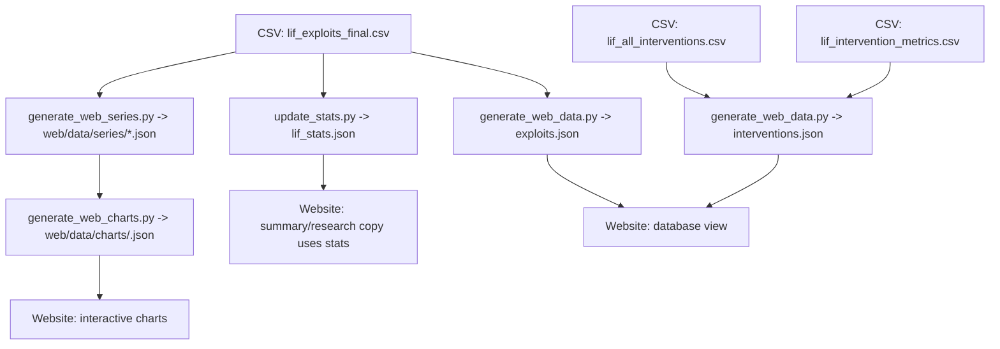

# Legitimate Intervention Framework — Website Development Plan

## Purpose
Evolve the website from a static project page into an academic, data-backed platform for the LIF paper and datasets.

This document is the **strategic plan**.
The step-by-step execution checklist lives in `../TODO.md`.

---

## Source of Truth (Dataset v1.0)
- **Exploits dataset:** `data/refined/lif_exploits_final.csv`
  - **705** total exploit cases
  - **601** LIF-relevant cases
  - **$78.805B** total losses (sum of `loss_usd`)
- **All interventions:** `data/refined/lif_all_interventions.csv` (**130** rows)
- **Metrics subset:** `data/refined/lif_intervention_metrics.csv` (**52** rows)

All website numbers and charts must be generated from this dataset version.

---

## Hosting and Routing Constraints
The site must work on:
- Standard static hosts (Cloudflare/Vercel)
- **IPFS** (no server routing assumptions)

Therefore:
- Research theme pages must use **directory routing**: `research/<theme>/index.html`
- Deep links must use **query parameters**, not hash anchors, for consistency.

---

## Information Architecture (IA)
Inspired by `ai-2027.com`.

### Core routes (static)
- `/` (landing / home)
- `/summary/` (paper summary; concise-version inspired)
- `/research/` (theme index)
- `/research/<theme>/` (focused supplement pages)
- `/research/all/` (full 50-chart narrative view)
- `/database.html` (case-level searchable database)
- `/about.html` (about, data sources, changelog)

### Navigation
- **Research** in the navbar has a **dropdown** listing themes for quick access.

---

## Deep-Linking Specification (Query Params)
### Database
- `database.html?search=<term>`: filters table
- `database.html?id=<incident_id>`: opens case modal

### Research
- `research/<theme>/?chart=<chart_id>`: scroll to chart section
- `research/all/?chart=<chart_id>`: scroll to chart section

The deep-link contract must remain stable across refactors.

---

## Data and Build Pipeline (Standardized)
### Stats
- Standardize to a single stats file: `data/refined/lif_stats.json`
- Deprecate: `data/refined/lif_stats_v1.0.json`

### Web data exports
Generate:
- `web/data/exploits.json`
- `web/data/interventions.json`
- Aggregated series JSON for interactive charts:
  - `web/data/series/yearly_totals.json`
  - `web/data/series/cumulative_totals.json`
  - `web/data/series/vector_distribution.json`
  - `web/data/series/four_layer_yearly_losses.json`
 - Per-chart interactive specs (Option A, on-demand loading):
   - `web/data/charts/<chart_id>.json`
 
Generate with:
- `python3 scripts/core/generate_web_series.py`
- `python3 scripts/core/generate_web_charts.py`

Notes:
- `web/data/interventions.json` is an export of the 130 exploit-linked intervention cases in `lif_all_interventions.csv` plus 7 metrics-only proactive cases present only in `lif_intervention_metrics.csv` (137 total records).
- Each intervention record includes `is_proactive` to distinguish proactive / metrics-only cases.

### Charts
- `scripts/analysis/lif_charts_v1.ipynb` must be audited for:
  - Correctness
  - Consistency with the paper figures (including the **4-layer annual loss timeline**)
  - Web-ready aggregated exports
  - Updated notebook markdown narrative (not only code)

---

## UX and Content Principles
- Keep copy **fact-forward** and aligned with the paper tone.
- Avoid ideological/inflammatory framing.
- Treat charts and numbers as primary artifacts; narrative should cite and explain.

---

## Global UI Requirements
### Active development banner
- Add a dismissible banner on all pages (SomaliScan-inspired):
  - “This site is under active development. Data coverage is expanding and may contain errors. Please submit corrections.”

### Footer
- Add a consistent footer across pages with:
  - Research/educational disclaimer (may contain errors/omissions)
  - Placeholder links: Terms, Privacy, Request Correction (implementation TBD)
  - Correction/tip contact method
  - the illustration like in the about page must remain

---

## Implementation Phases

### Phase 1 — Plan alignment and cleanup
- Align all references to the dataset v1.0 numbers (705 / 601 / $78.805B / 130 / 52)
- Standardize on `lif_stats.json` - note that this is generated when running the notebook `lif_charts_v1.ipynb`
- Confirm deep-link conventions and theme structure

### Phase 2 — IA refactor (static + IPFS-compatible)
- Add `/summary/`
- Convert `/research/` into a theme index
- Add `/research/<theme>/` pages
- Add `/research/all/`
- Implement navbar dropdown for themes

### Phase 3 — Data regeneration for web
- Regenerate `web/data/exploits.json` and `web/data/interventions.json`
- Add aggregated series JSON exports for interactive charts

### Phase 4 — Chart correctness audit (paper-aligned)
- Fix `lif_charts_v1.ipynb` logic gaps
- Implement the **4-layer annual loss** timeline figure
- Update notebook markdown narrative
- Regenerate visual/chart artifacts used by web

### Phase 5 — UX polish and trust layer
- Implement banner + footer across pages
- Rewrite landing and summary copy to be neutral and paper-aligned
- Ensure research pages are readable in focused thematic chunks

---

## Success Criteria
- All deep links work on static hosting and IPFS.
- All site numbers and claims match dataset v1.0 and `lif_stats.json`.
- Research is consumable via:
  - theme pages
  - full 50-chart narrative (`/research/all/`)
- Database supports `?search=` and `?id=`.
- Banner + footer present site-wide.

---

*Plan updated: 2026-02-13*
