# Legitimate Intervention Framework (LIF) — Research Report

**Version:** v1.2 (January 2026)  
**Authors:** Elem Oghenekaro  
**Repository:** [github.com/e3o8o/legitimate-intervention-framework](https://github.com/e3o8o/legitimate-intervention-framework)

---

> **Interactive Data:** [Chat with the full dataset on NotebookLM](https://notebooklm.google.com/notebook/98177ced-1daf-468f-8e89-81f018a5d25c)

> **Context:** This report contributes to GnosisDAO's ["A Framework for the Future"](https://forum.gnosis.io/t/a-framework-for-the-future/11914) consultation. An academic treatment of this research—*"Legitimate Overrides in Decentralized Protocols"* by Elem Oghenekaro and Dr. Nimrod Talmon—is forthcoming and provides the formal game-theoretic foundations for the intervention design space explored here.

---

## Executive Summary

The cryptocurrency industry has lost **$78.81 billion** to exploits, hacks, and systemic failures since 2014. This research analyzes **705 exploit cases** and **130 documented interventions** to answer a fundamental question: *When is it legitimate for a decentralized system to override its own rules?*

### The Uncomfortable Truth

We discovered that the debate over "Code is Law" versus "Intervention" is already settled in practice:

- **21% of blockchains** already have fund-freezing capabilities (Bybit Security Lab, Nov 2025)
- **80.6%** of at-risk capital saw intervention attempts in our dataset
- **$2.51 billion** was prevented through coordinated intervention events

The question is no longer *whether* to intervene, but *how* to do so legitimately.

### Key Findings

| Metric | Finding |
|:-------|:--------|
| **Total Market** | $12.99B in LIF-addressable risk |
| **Prevented** | $2.51B (19.4% of market) |
| **Effectiveness Gap** | Only 26.5% of covered risk was saved |
| **Speed Premium** | Signer Sets prevent 2.5× more capital than Governance |
| **Learning Curve** | 10.9% success (2024) → 82.5% success (2025) |

### The Verdict

The primary challenge is no longer *coverage* (reaching incidents) but *effectiveness* (successfully stopping them). The **$7.70 billion** incurred despite intervention represents the ROI opportunity for improved intervention systems.

---

## Methodology

### Data Collection

This research aggregates exploit data from four primary sources, spanning 2014-2026:

| Source | Coverage | Records | Notes |
|:-------|:---------|:--------|:------|
| Charoenwong & Bernardi (2022) | 2011-2021 | 30 | Academic study, [SSRN 3944435](https://ssrn.com/abstract=3944435) |
| De.Fi Rekt Database | 2021-2026 | ~450 | Industry incident database |
| Rekt.news Reports | 2020-2025 | 282 | Investigative post-mortems |
| DeFiHackLabs | 2022-2026 | ~200 | Technical incident tracking with PoC |
| Manual Research | 2014-2026 | 120 | Intervention curation from forums, tweets, post-mortems |

### Data Pipeline

```
Raw Sources (4 databases, 1903 records)
    │
    ▼
Parse & Standardize
    │  • Normalize date formats
    │  • Standardize USD values
    │  • Map attack vectors to taxonomy
    ▼
Deduplicate & Cross-Reference
    │  • Match on: protocol, date (±3 days), loss (±10%)
    │  • Manual review for edge cases
    ▼
LIF Relevance Tagging
    │  • is_technical: Code exploit vs. social/agency
    │  • is_lif_relevant: Intervention-eligible
    │  • is_intervention: Intervention actually occurred
    ▼
Intervention Metrics (Manual)
    │  • Source post-mortems and security analyses
    │  • Extract timing data (detection, containment)
    │  • Classify scope and authority
    ▼
Final Datasets
    • lif_exploits_final.csv (705 cases)
    • lif_all_interventions.csv (130 exploit-linked interventions)
    • lif_intervention_metrics.csv (52 detailed cases)
```

### Dataset Construction

**Main Exploits Dataset (705 cases):**
- Deduplicated from 1903 raw records across all sources
- Standardized to consistent schema (see `methodology/data_dictionary.md`)
- Tagged for LIF relevance based on technical nature and intervention eligibility

**Intervention Datasets:**
- **All Interventions (130 cases):** Every DeFi exploit where `is_intervention = True`
- **Metrics Dataset (52 cases):** Hand-curated subset with detailed timing data, sourced from official post-mortems, on-chain evidence, and security team disclosures
- **Combined Unique (137 cases):** 130 + 7 proactive-only cases (from metrics dataset)

### Analysis Approach

**Quantitative Analysis:**
- Jupyter notebook (`scripts/analysis/lif_charts_v1.2.ipynb`) generates all 50 visualizations
- Statistical aggregations: loss totals, intervention rates, success distributions
- Time-series analysis: authority evolution, learning curve detection

**Taxonomy Development:**
- **Scope dimension:** Derived from intervention blast radius (Network → Account)
- **Authority dimension:** Derived from trigger holder analysis (Signer Set → Governance)
- Cross-validated against Bybit Security Lab's 166-chain survey (Nov 2025)

**Intervention Effectiveness:**
- `containment_success_pct` = (loss_prevented / (loss_prevented + loss_incurred)) × 100
- Response time = `time_to_detect_min` + `time_to_contain_min`
- Authority performance benchmarked by median response time and total capital prevented

### Limitations

| Aspect | Limitation |
|:-------|:-----------|
| **Response times** | Often estimated from public disclosure timing; actual detection may be earlier |
| **Outcome data** | Some cases lack complete post-mortem documentation |
| **Selection bias** | Successful interventions may be over-represented (more likely to be documented) |
| **USD valuation** | Historical snapshot rates; not adjusted for subsequent price movements |

### Reproducibility

All data and code are available at [github.com/e3o8o/legitimate-intervention-framework](https://github.com/e3o8o/legitimate-intervention-framework):

- `data/raw/` — Original source data
- `data/refined/` — Processed datasets
- `scripts/analysis/` — Jupyter notebooks
- `methodology/` — Data dictionary, provenance documentation

---

## Part I: The Scale of the Threat

### 1.1 A History Written in Losses

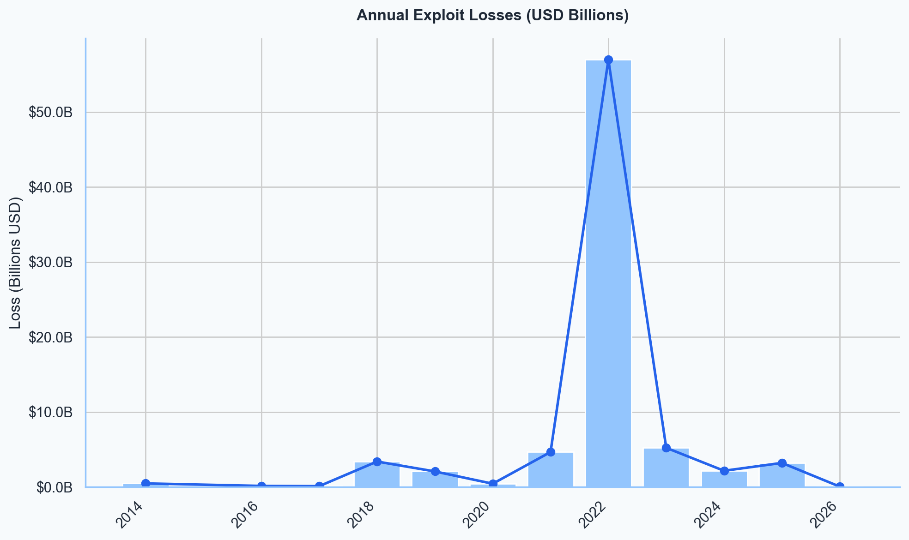
*Annual exploit losses reveal 2022 as the catastrophe year ($58.06B), driven by Terra/Luna and FTX. The 2025 resurgence ($3.76B) signals that the threat is not receding.*

The cryptocurrency industry likes to believe it has moved past its "Wild West" phase. The data tells a different story.

Between 2014 and January 2026, we documented **705 exploit cases** resulting in **$78.81 billion** in cumulative losses. To put this in perspective:
- This exceeds the GDP of Luxembourg
- It is larger than the market capitalization of 95% of publicly traded companies
- It represents roughly **15% of the industry's all-time high market cap**

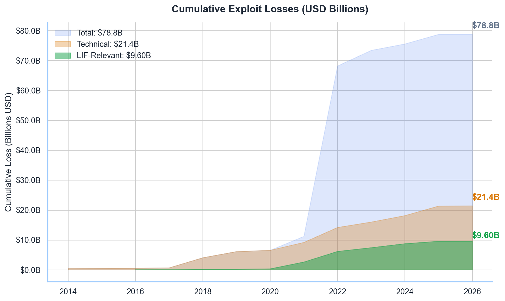
*Cumulative losses show $78.81B total. The LIF-relevant subset—cases where intervention was technically possible—represents $9.60B.*

Yet raw totals obscure an important pattern: **losses are extraordinarily concentrated**.

### 1.2 The Power Law of Catastrophe

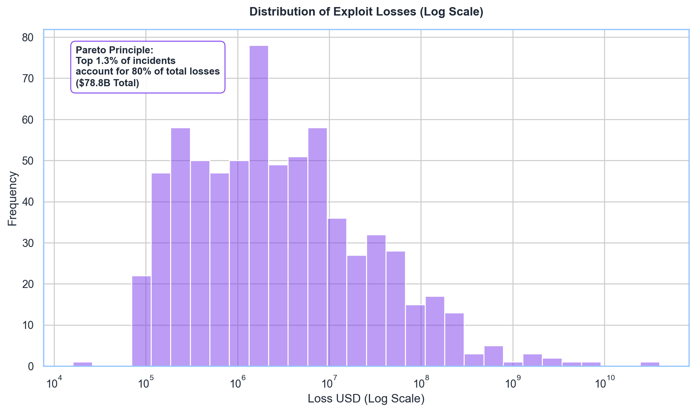
*Loss distribution follows a power law. The top 1.4% of cases cause 80% of total losses.*

When we ranked all 705 incidents by magnitude, we discovered:

- **9 incidents** (1.3%) account for **80% of all losses**
- **66 incidents** (9.2%) account for **95% of all losses**
- The remaining 652 incidents share only 5% of total value lost

This Pareto concentration has profound implications for intervention design:

> An intervention capability is only as valuable as its ability to respond to "super-hacks"—the rare catastrophic events that dominate total ecosystem damage.

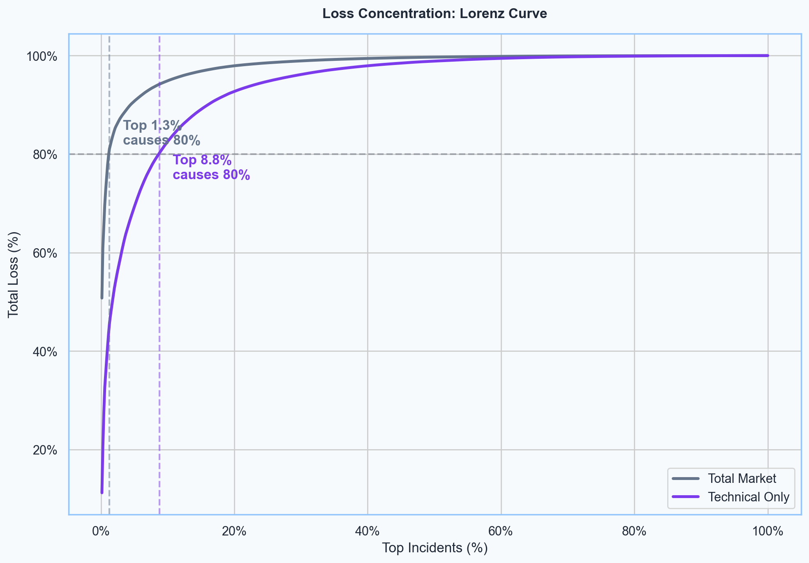
*Lorenz curve shows extreme skew. Addressing the top ~66 technical incidents would cover 80% of the preventable market.*

### 1.3 The Addressable Market

Not all losses are intervention-eligible. Our taxonomy distinguishes between:

| Category | Cases | Value | Notes |
|:---------|:------|:------|:------|
| **Systemic Failures** | 10 | $61.80B | Terra, FTX—economic design flaws |
| **Rug Pulls/Other** | 94 | $7.41B | Malicious actors, phishing, unpausable bugs |
| **LIF-Relevant** | 601 | $9.60B | Technical exploits with intervention-eligible protocols |
| **Total** | 705 | $78.81B | — |

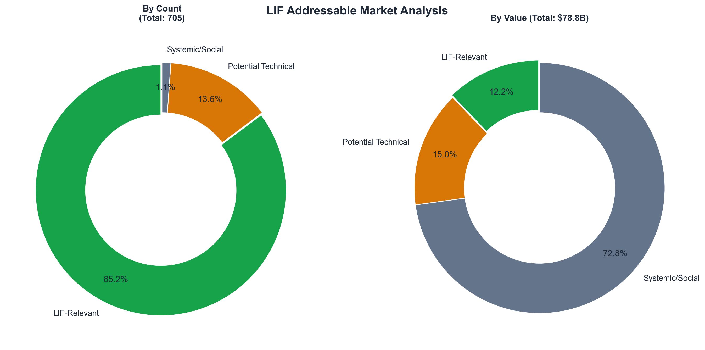
*LIF-relevant cases are 59.1% of incident count but only 12.7% of value—targeting "everyday" technical risk rather than rare $40B+ systemic collapses.*

The Legitimate Intervention Framework focuses on the **$9.60 billion** in tractable technical exploits—events where a well-designed pause, freeze, or recovery mechanism could have made a difference.

### 1.4 Attack Vector Analysis

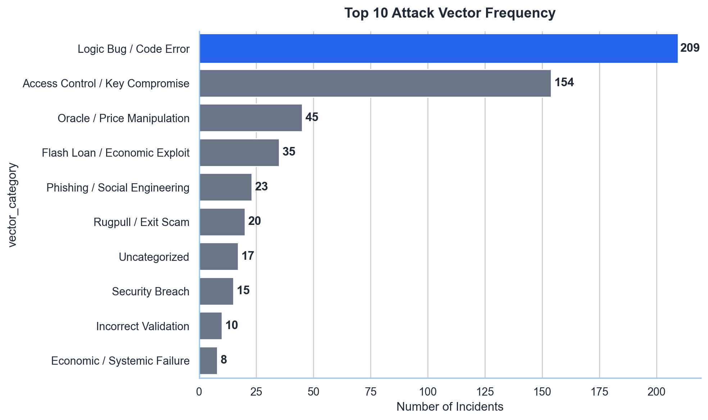
*Logic Bugs (231) and Key Compromises (154) lead attacking vectors by frequency.*

Understanding *how* attacks occur reveals where intervention is most needed:

| Attack Vector | Count | Total Losses | Intervention Potential |
|:--------------|:------|:-------------|:-----------------------|
| Logic Bugs | 231 | $5.59B | High—pausable at protocol level |
| Key Compromise | 154 | $4.39B | Medium—depends on key architecture |
| Flash Loan | 89 | $1.12B | High—detectable, pausable |
| Oracle Manipulation | 67 | $0.98B | High—circuit breakers effective |
| Reentrancy | 45 | $0.71B | High—well-understood patterns |

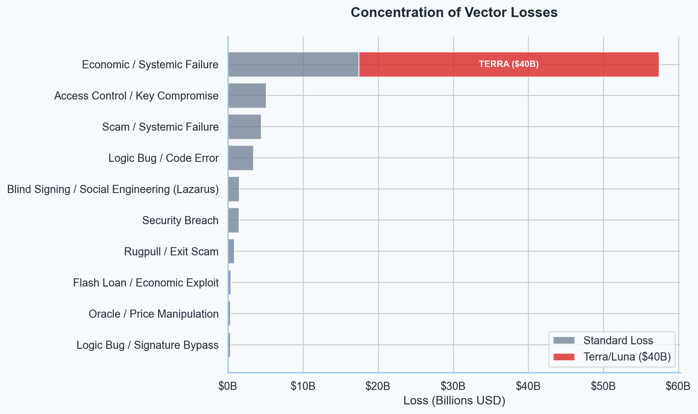
*By value, Logic Bugs ($5.59B) and Key Compromises ($4.39B) define the addressable market.*

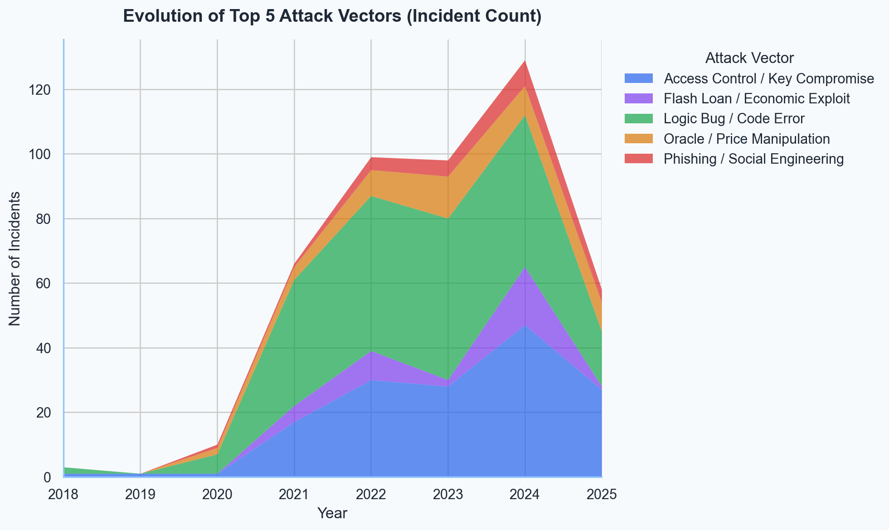
*Attack vector evolution shows Flash Loan attacks declining while Key Compromise and Logic Bugs remain persistent threats.*

### 1.5 The AI Acceleration

A December 2025 red team study by Anthropic demonstrated that AI agents can now autonomously:

- Identify vulnerabilities in Solidity contracts
- Generate exploit payloads with 55.8% success against human benchmarks  
- Execute end-to-end attacks for **$1.22 in compute costs**

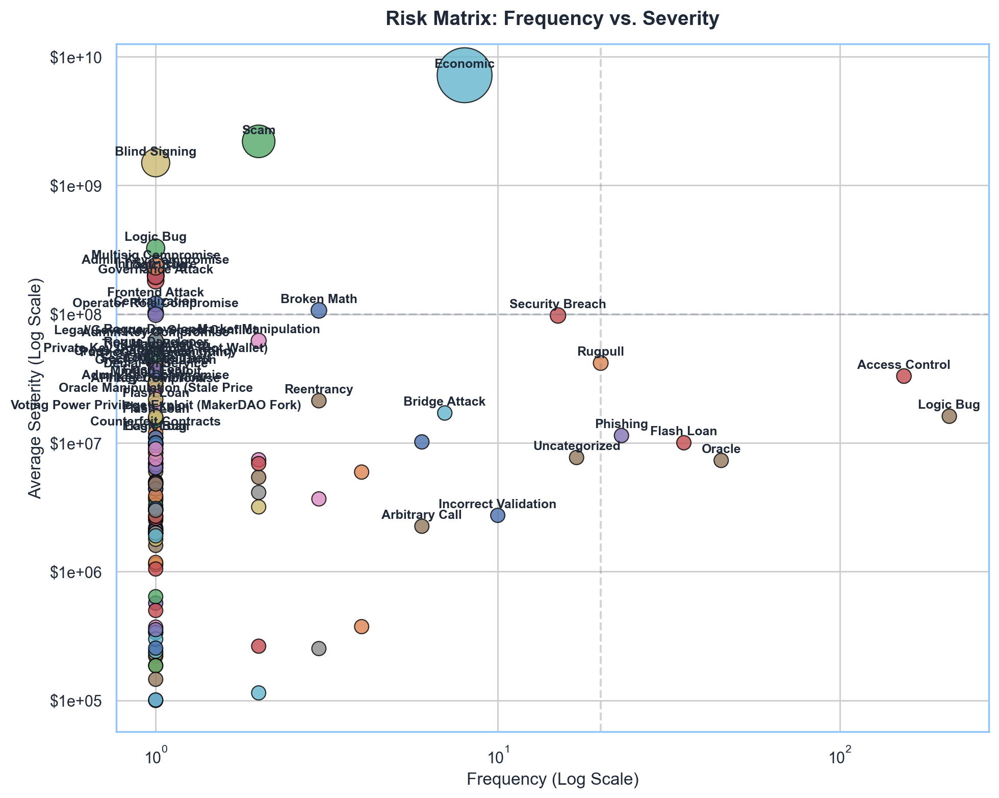
*Risk matrix identifies the "Kill Zone"—Logic Bugs and Key Compromises in the high-frequency, high-severity quadrant.*

This changes the calculus fundamentally. The "Sovereign Individual" model—where each user is responsible for their own security—assumes a human adversary with human limitations. Against an automated adversary that doubles in capability every 1.3 months, individual vigilance is insufficient.

---

## Part II: The State of Intervention

### 2.1 Intervention Is Already Here

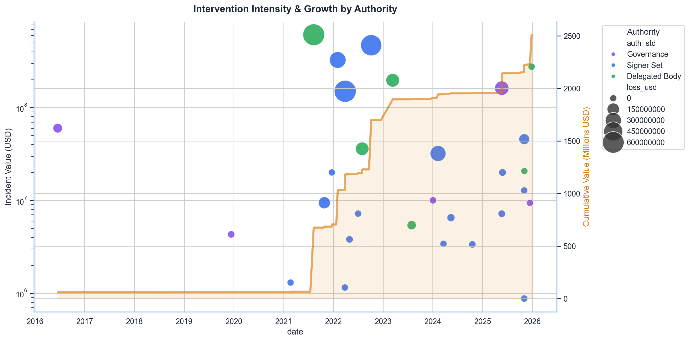
*Cumulative intervention timeline shows $1.35B in addressable incidents, steepening dramatically in 2024/2025.*

The debate over whether decentralized systems should have intervention capabilities is already settled in practice:

- **21%** of 166 surveyed blockchains have active fund-freezing functions (Bybit Security Lab)
- **19% more** could introduce similar capabilities with minor changes
- **130 documented interventions** occurred in our dataset (2016-2026)

The question is not *whether* intervention happens, but *how transparently* it is governed.

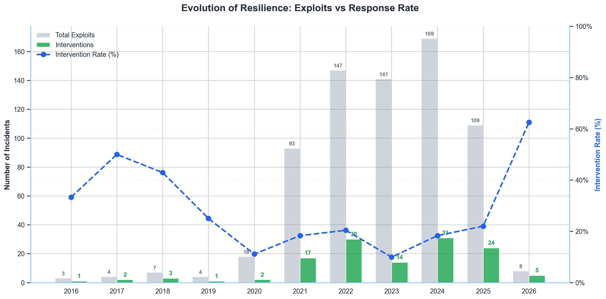
*2025 achieved a 20.4% intervention rate (23 interventions vs. 113 hacks)—a significant improvement over prior years.*

### 2.2 The Intervention Taxonomy

We classify interventions along two dimensions:

**Scope (Precision) — from blunt to surgical:**

| Level | Scope | Example | Blast Radius |
|:------|:------|:--------|:-------------|
| 1 | Network | Chain halt | Maximum |
| 2 | Asset | Token freeze | High |
| 3 | Protocol | dApp pause | Medium |
| 4 | Module | Feature pause | Low |
| 5 | Account | Targeted freeze | Minimal |

**Authority (Legitimacy) — from concentrated to distributed:**

| Type | Description | Speed | Legitimacy |
|:-----|:------------|:------|:-----------|
| Signer Set | Fixed key-holders (e.g., 3-of-5 multisig) | Fastest | Lowest |
| Delegated Body | Council with bounded mandate | Medium | Medium |
| Governance | Token-holder vote | Slowest | Highest |

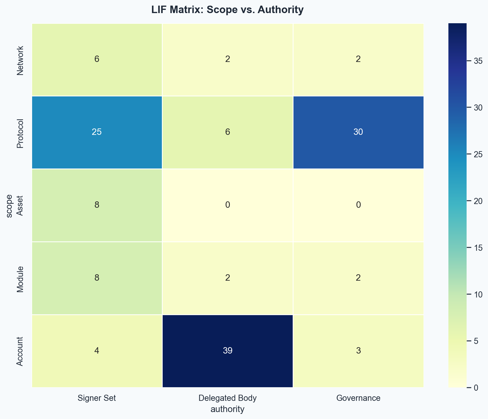
*The "Safety Square"—Protocol×Governance (33 cases) and Account×Delegated Body (42 cases) dominate real-world interventions.*

### 2.3 Authority Performance: The Speed-Legitimacy Tradeoff

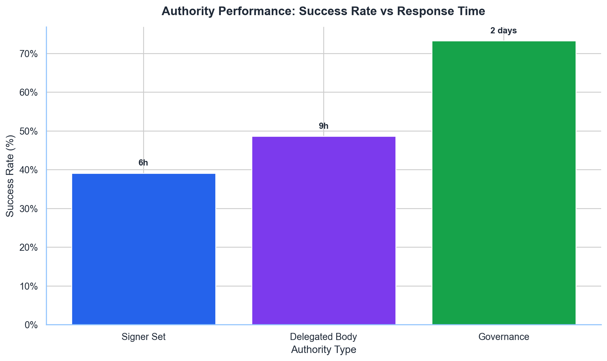
*Signer Sets are fastest responders (~1 hour); Delegated Bodies and Signer Sets outperform Governance in capital saved.*

Our data reveals a clear tradeoff:

| Authority | Median Response | Success Rate | Capital Prevented |
|:----------|:----------------|:-------------|:------------------|
| **Signer Set** | ~60 minutes | 51.6% | $1.63B |
| **Delegated Body** | ~45 minutes | 55.6% | $0.88B |
| **Governance** | ~61 hours | 89.8% | $0.40B |

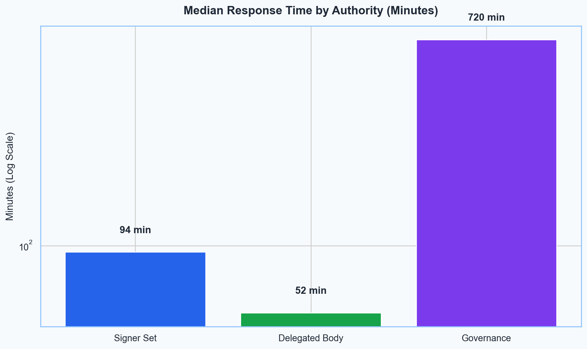
*The Speed Gap: Signer Sets (60 min), Delegated Bodies (45 min), Governance (3,660 min / 61h).*

Governance achieves the highest *success rate* (89.8%) but the lowest *capital prevented* ($0.40B). Why? By the time a governance vote concludes, most movable funds have already been extracted.

> **Key Insight:** Speed matters more than consensus for capital protection. Signer Sets and Delegated Bodies are the primary drivers of prevented losses.

### 2.4 The Learning Curve

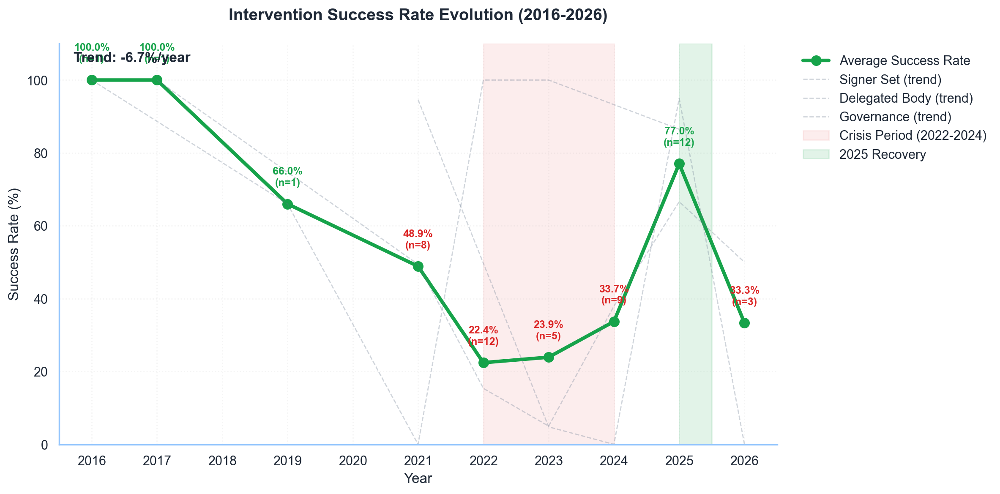
*2024 Crisis (10.9% success) → 2025 Recovery (82.5% success). The industry is learning.*

Perhaps the most encouraging finding is the dramatic improvement in intervention effectiveness:

| Year | Success Rate | Key Events |
|:-----|:-------------|:-----------|
| 2016-2017 | 100% | Early simple cases |
| 2019 | 66% | Increasing complexity |
| 2021 | 31.5% | DeFi Summer chaos |
| 2022 | 64.1% | Recovery year |
| 2023 | 36.5% | Complex exploits |
| **2024** | **10.9%** | **Worst crisis year** |
| **2025** | **82.5%** | **Dramatic recovery** |
| 2026 (Jan) | 100% | Early year promise |

What happened between 2024 and 2025?

**The Maturation of Delegated Bodies:**
- Delegated Body success: 0% (2024) → 95% (2025)
- Signer Set success: 0% (2021) → 71% (2025)

Protocols learned from the 2024 crisis. They invested in:
1. **Monitoring partnerships** (e.g., Hypernative)
2. **Emergency subDAOs** with clear mandates (e.g., Curve, Balancer V3)
3. **Surgical capabilities** (account-level freezes vs. protocol-wide halts)

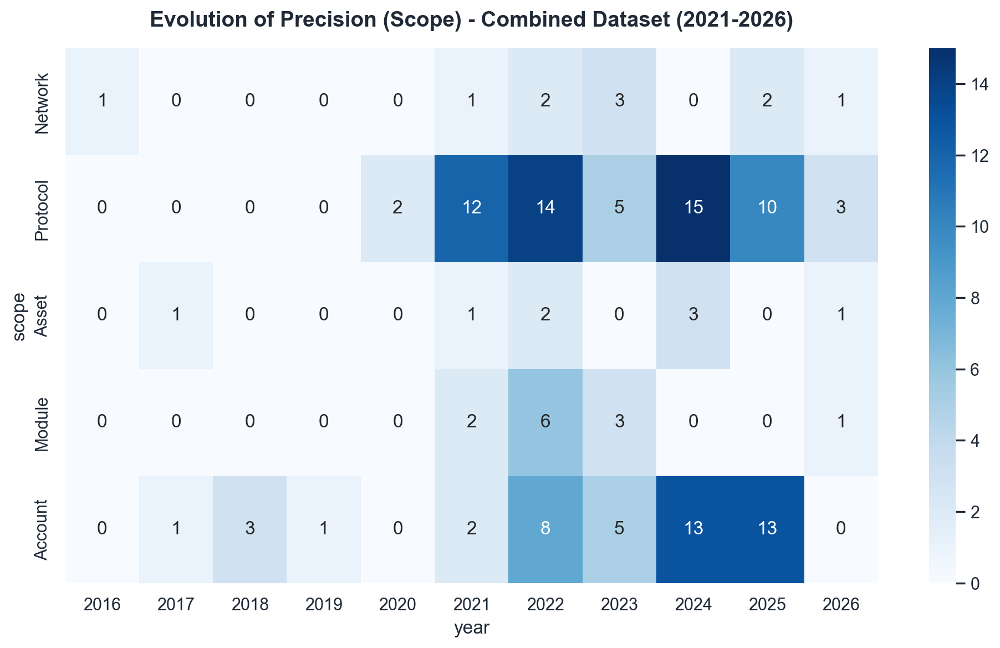
*Shift from Protocol pauses (2021) to Account surgical freezes (2024)—evidence of tooling maturity.*

---

## Part III: The Effectiveness Gap

### 3.1 Coverage vs. Effectiveness

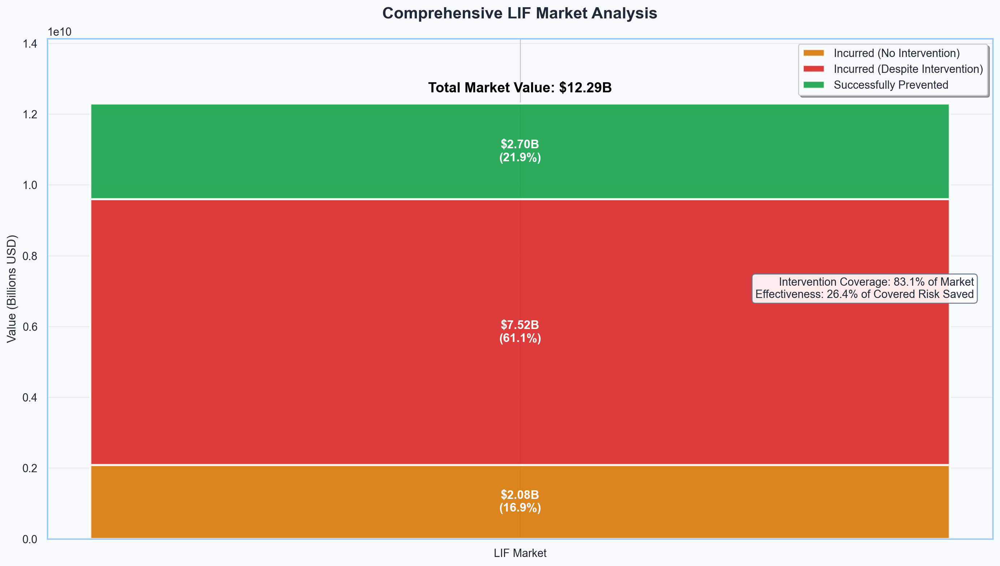
*LIF Market Analysis: $12.99B total, $2.51B prevented (19.4%), 80.6% coverage, 26.5% effectiveness.*

The most important finding of this research:

| Segment | Value | % of Market |
|:--------|:------|:------------|
| **Successfully Prevented** | $2.51B | 19.4% |
| **Incurred (Despite Intervention)** | $7.70B | 59.3% |
| **Incurred (No Intervention)** | $2.78B | 21.4% |
| **Total LIF Market** | $12.99B | 100% |

The industry has achieved **high coverage** (80.6% of at-risk capital saw intervention attempts) but **low effectiveness** (only 26.5% of covered risk was saved).

> The main challenge is not reaching more incidents—it is successfully stopping the ones we reach.

### 3.2 The Bimodal Distribution

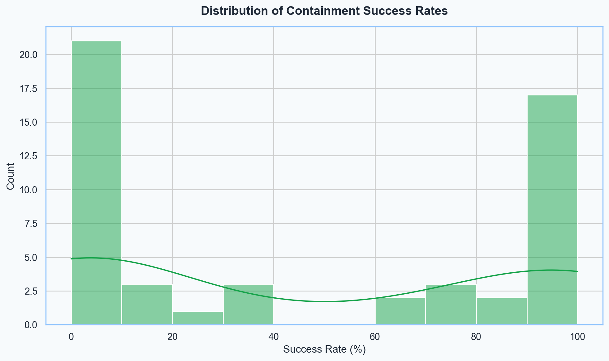
*Interventions are either near-complete successes (90%+) or significant failures (<10%). Few middle outcomes.*

Intervention outcomes cluster at extremes:

- **Excellent cases (≥95% success):** 12 cases across all authorities
- **Failed cases (≤10% success):** 7 cases, mostly Signer Set (4) and Delegated Body (3)

This bimodal pattern suggests that intervention success depends heavily on:
1. **Speed of detection** (catching the attack early in its lifecycle)
2. **Pre-positioning** (having the right tools and authorities in place)
3. **Coordination rehearsal** (having practiced the response)

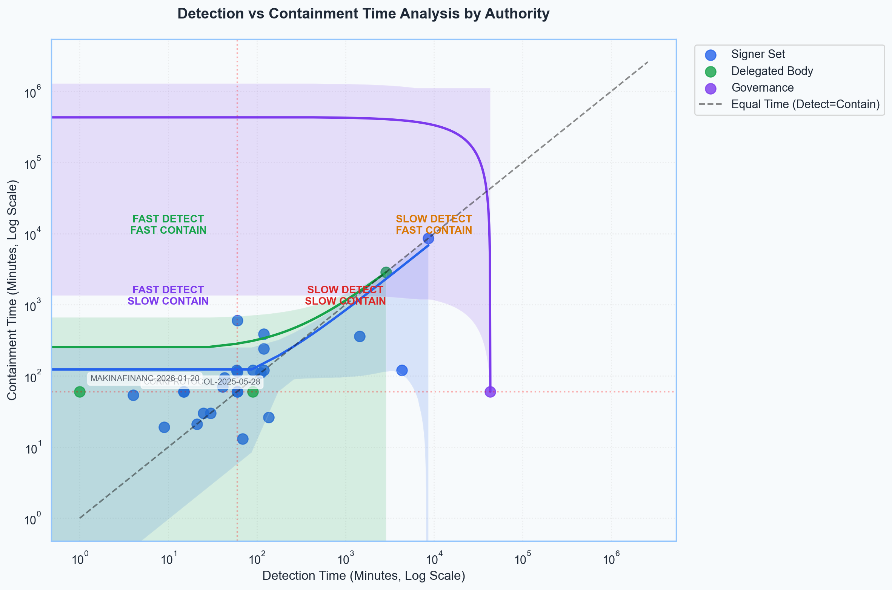
*For Signer Sets, containment is a direct function of detection speed. Every minute of detection delay increases loss.*

### 3.3 The $7.70B Opportunity

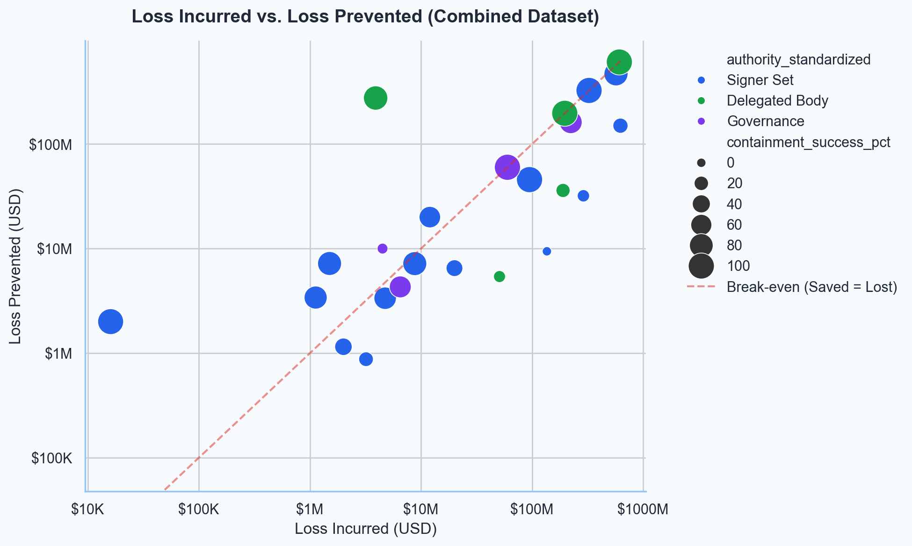
*ROI analysis: Signer Sets dominate the "Low Loss / High Saved" quadrant; Governance handles "last line" recovery.*

The **$7.70 billion** incurred despite intervention represents the addressable opportunity for improved intervention systems. To capture more of this value, protocols need:

1. **Faster detection** — Automated monitoring, behavioral anomaly detection
2. **Pre-authorized response** — Clear triggers, pre-approved actions
3. **Surgical precision** — Account-level rather than protocol-level pauses
4. **Transparent governance** — Clear authority, mandatory post-mortems

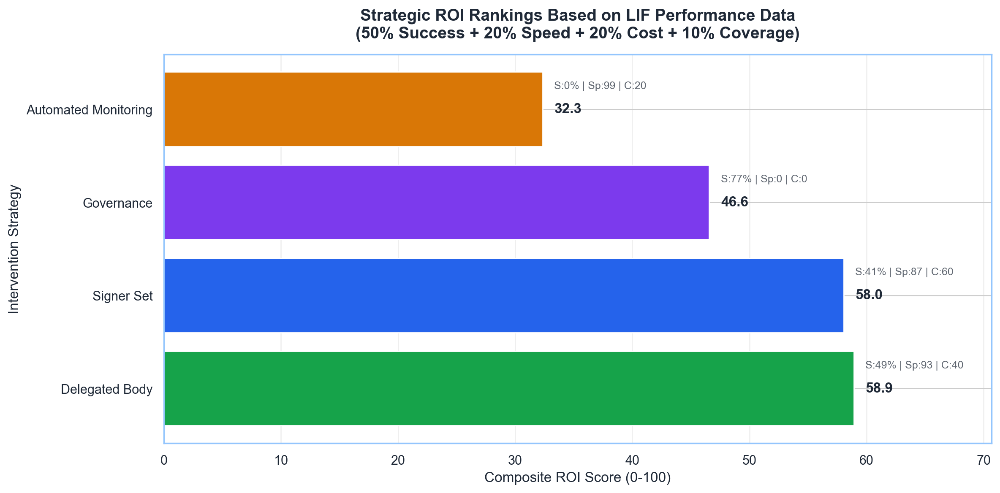
*Strategic ROI Rankings: Signer Sets (65.5) win on the balance of success, speed, and cost.*

---

## Part IV: The Framework

### 4.1 The Hierarchy of Precision

Moving beyond binary "Halt vs. Nothing" thinking, we propose a graduated intervention spectrum:

| Level | Scope | Example | Blast Radius | Authority Options |
|:------|:------|:--------|:-------------|:------------------|
| 1 | Network | Chain halt | Maximum | Validator coordination |
| 2 | Asset | Token freeze | High | Issuer, Bridge Board |
| 3 | Protocol | dApp pause | Medium | Admin key, Guardian |
| 4 | Module | Feature pause | Low | Guardian, Governance |
| 5 | Account | Targeted freeze | Minimal | Council, Governance vote |

**Principle of Minimal Intervention:** Always prefer the least restrictive scope that achieves the security objective.

### 4.2 Legitimacy Conditions

For intervention to be legitimate, it must satisfy four conditions:

| Condition | Requirement | Example |
|:----------|:------------|:--------|
| **Transparency** | Criteria documented before crisis | Published GIP with trigger conditions |
| **Proportionality** | Scope matches severity; time-limited; reversible | Account freeze vs. chain halt |
| **Accountability** | Clear authority chain; post-incident review | Named Emergency Council, public post-mortem |
| **Due Process** | Appeals mechanism; evidence standards | Ratification vote within 24-48h |

### 4.3 The "Optimistic Freeze" Model

Inspired by optimistic rollups, we propose:

```
┌─────────────────────────────────────────────────────────────┐
│  PRE-INCIDENT: Rules defined via GIP before any crisis     │
│                                                             │
│  INCIDENT: Emergency Council acts within pre-approved       │
│            registry (bounded, allowlisted actions)          │
│                                                             │
│  RATIFICATION: DAO confirms within 24-48h or action lapses  │
│                                                             │
│  POST-INCIDENT: Mandatory public post-mortem within 7 days  │
└─────────────────────────────────────────────────────────────┐
```

This model:
- **Preserves speed** — EC acts immediately against genuine threats
- **Preserves legitimacy** — DAO retains ultimate authority
- **Prevents entrenchment** — Actions lapse without ratification
- **Builds institutional memory** — Mandatory post-mortems

---

## Part V: Case Evidence

### 5.1 The Balancer/Gnosis Cluster (November 2025)

The November 2025 Balancer exploit represents the most sophisticated multi-layered intervention in DeFi history, demonstrating how coordinated response across protocols and chains can recover the majority of stolen assets.

**The Vulnerability:** A rounding direction bug in the `_upscale` function for CSPv6 "exact out" swaps, combined with rate providers introducing imprecision and low liquidity states to magnify extraction.

**Timeline (UTC, Nov 3-4, 2025):**

| Time | Event | Authority |
|:-----|:------|:----------|
| 07:48 | Exploit execution begins | — |
| 07:52 | Hypernative flags anomaly, war room activated | Monitoring |
| 08:07 | CSPv6 paused across Ethereum, Arbitrum, Base, Polygon | **Signer Set** |
| 08:18 | Berachain becomes aware of BEX impact | Detection |
| 08:40 | BEX Vault paused | **Signer Set** |
| 10:05 | Berachain chain halted by validators | **Signer Set** |
| 14:30 | Hard fork proposed for Berachain | **Delegated Body** |
| 15:15 | StakeWise DAO emergency multisig activated | **Delegated Body** |
| 16:45 | StakeWise recovery complete (90 min) | **Delegated Body** |
| Nov 4, 15:30 | Berachain chain restarted after 30h halt | **Delegated Body** |

**StakeWise Recovery (Account × Delegated Body):**

The StakeWise DAO's 7/7 emergency multisig executed a surgical recovery of 5,041 osETH ($19M) and 13,495 osGNO ($1.7M) using the controller role to burn tokens from the attacker's address and remint to the DAO treasury—a 100% recovery at the account level.

> *"The multisig members questioned the team's intentions before signing, which is exactly the accountability we wanted."* — [StakeWise SWIP-37 Forum Post](https://forum.stakewise.io/t/swip-37-renounce-oseth-osgno-token-contract-ownership-from-the-dao-address/1990)

**Gnosis Soft Fork (Network × Governance):**

With over 340,000 validators, Gnosis could not execute a unilateral freeze. Instead:

1. **Soft Fork Approach:** Validators voluntarily adopted a client refusing to attest to blocks moving hacker balances
2. **Hard Fork Promise:** Full redistribution scheduled with regular network update
3. **Bridge Protection:** Monerium froze €3M+ in EURe balances; bridge governors halted cross-chain flows

> *"A hard fork would require all ~340,000 validators to upgrade almost immediately... anyone who failed to upgrade in time would be penalized."* — [Gnosis Forum: Balancer Hack Update](https://forum.gnosis.io/t/balancer-hack-update/11759)

**Outcome:** $45.7M protected/recovered against $94.8M exploit (48.2% recovery), demonstrating the value of layered defenses and ecosystem coordination.

---

### 5.2 The Flow Isolated Recovery (December 2025)

The largest successful intervention in DeFi history: **$7.07B in counterfeit FLOW recovered** using surgical account-level remediation instead of a chain rollback.

**The Attack:** Exploiter deployed 40+ malicious contracts exploiting a type confusion vulnerability in Cadence runtime v1.8.8, minting 87.96 billion counterfeit FLOW tokens ($7B face value).

**Timeline (UTC, Dec 26-30, 2025):**

| Time | Event |
|:-----|:------|
| Dec 26, 23:25 | Attacker deploys exploitable contracts (Block 137363398) |
| 23:35-23:42 | Counterfeit tokens duplicated and transferred to CEX accounts |
| 00:06 (Dec 27) | Small volume bridged off-network via Celer, deBridge, Stargate |
| 01:30 | Detection: Anomalous cross-VM movements flagged |
| 05:23 | **Chain halt:** Validators stop transaction ingestion |
| Dec 29, 05:00 | **Phase 1:** Cadence restored; 1,060 addresses restricted; 99.99% accounts regain access |
| Dec 30, 07:00 | **Phase 2:** HCU executed; 98.7% counterfeit assets recovered |
| Jan 2, 07:00 | **Phase 3:** EVM remediation complete; network fully operational |

**The Design Choice:**

Flow's Community Governance Council (CGC) explicitly rejected a checkpoint restoration (rollback), opting for an "Isolated Recovery Plan" that:

- Targeted exactly **1,060 addresses** (under 0.01% of the network)
- Preserved **all legitimate transaction history**
- Required a Height Coordinated Upgrade (HCU) ratified by validators

> *"The recovery required temporary elevated permissions, which were revoked upon conclusion of remediation."* — Flow Foundation Post-Mortem

**Outcome:** $3.9M realized loss vs. $7B attack → **99.25% recovery rate**. Proof that L1s can defend against "nuclear-scale" minting exploits without nuclear-scope rollbacks.

---

### 5.3 Sui/Cetus: Governance-Authorized Recovery (May 2025)

The most rigorous governance-authorized intervention: **$162M recovered** with 90.9% validator approval.

**The Process:**

1. **Detection:** Exploit drains $220M from Cetus DEX
2. **Initial Freeze:** Sui validators coordinate to refuse processing attacker transactions (Delegated Body)
3. **Governance Vote:** On-chain proposal submitted; 90.9% of stake votes "Yes"
4. **Recovery:** Funds transferred to 4-of-6 multisig (Cetus, Sui Foundation, OtterSec)

**Why It Matters:**

- **Sui Foundation abstained** from the vote to maintain neutrality
- The protocol upgrade created an address "alias" allowing a specific multisig to act as the account owner—**zero blast radius** to legitimate users
- Two-phase model (Delegated Body freeze → Governance recovery) became a template

> *Source: [Sui Foundation Blog: Cetus Incident Response](https://blog.sui.io/cetus-incident-response-onchain-community-vote/)*

---

### 5.4 The 2024 Crisis Cluster

Four interventions in 2024 achieved **0% success**, driving the year's 10.9% success rate:

| Incident | Authority | Detection Time | What Went Wrong |
|:---------|:----------|:---------------|:----------------|
| Radiant Capital (Oct) | Delegated Body | Immediate | Compromised hardware wallets bypassed front-end verification |
| DeltaPrime (Nov) | Signer Set | 15 min | claimRewards() vulnerability; 25-min pause window but funds already bridged |
| Sonne Finance (May) | Signer Set | 25 min | Donation attack on empty VELO market after 2-day timelock expired |
| Sonic/Beets (Nov) | Signer Set | 2 hours | Permit bypass: ERC-20 signatures moved frozen stS tokens |

**Radiant Capital ($50M loss):** Despite detecting the attack at 15:46 UTC and pausing across all chains by 17:40 UTC, the damage was done. Attackers had compromised 3 core team hardware wallets, allowing malicious transactions to pass front-end verification in Safe{Wallet}. — [Radiant Post-Mortem](https://medium.com/@RadiantCapital/radiant-post-mortem-fecd6cd38081)

**Sonic/Beets Permit Bypass:** The `freezeAccount` method successfully froze $874K (21.5%) of at-risk $S tokens, but the attacker used `permit()` signatures from a different address to move $3.2M in frozen stS tokens—a fundamental tension between gas efficiency and security.

---

### 5.5 Benchmark Cases by Cell

**Protocol × Signer Set: Cork Protocol (May 2025)**

| Metric | Value |
|:-------|:------|
| Detection | 4 minutes (Hypernative alert) |
| War room | 29 minutes |
| Full pause | 54 minutes |
| Protected | ~$20M in other vaults |

Cork's response to a Uniswap v4 hook exploit exemplifies best-in-class Protocol × Signer Set: third-party monitoring (Hypernative), pre-established multisig relationships, and parallel security firm validation (Spearbit, Quantstamp, Certora). — [Cork Post-Mortem](https://www.cork.tech/blog/post-mortem)

**Account × Governance: VeChain (Dec 2019)**

When 1.1B VET tokens ($6.5M) were stolen from an authority masternode, VeChain implemented a community-voted blocklist of 469 addresses, freezing 727M VET (66% recovery). Crucially, validators had to upgrade node software to reject transactions—a decentralized social consensus rather than admin fiat. — [VeChain Official Statement](https://x.com/vechainofficial/status/1988689432829108252)

**Network × Signer Set: BNB Chain (Oct 2022)**

The canonical Network × Signer Set case: $570M minting exploit; all 44 validators asked to suspend BSC; 5-hour coordinated halt; $470M contained (82.5%). — [BNB Chain Post-Mortem](https://www.bnbchain.org/en/blog/bnb-chain-a-decentralized-response)

**Protocol × Delegated Body: Aave Guardians**

5-of-9 multisig with community-elected members (Chaos Labs, BGD Labs, Stable Labs, Mariano Conti). Guardians hold EMERGENCY_ADMIN role to veto payloads, representing the "Sovereignty Sandwich"—Governance on top, Delegated Body for emergency response, avoiding Signer Set centralization. — [Aave Governance Docs](https://governance.aave.com/)

**Asset × Delegated Body: Curve Emergency DAO**

5-of-9 multisig spanning Yearn (banteg), Convex (C2tP), and StakeDAO (Quentin). Can stop CRV emissions or pause the Peg Stabilization Reserve, but cannot stop deposits/withdrawals—deliberately surgical rather than nuclear. — [LlamaRisk: Curve Analysis](https://hackmd.io/@LlamaRisk/BJzSKHNjn)

---

### 5.6 Historical Landmarks

**Poly Network (Aug 2021) — $611M Stolen, $578M Returned (94.6%)**

The largest DeFi hack at the time became a landmark social recovery:

- Tether immediately blacklisted $33M USDT in stolen addresses
- On-chain negotiation: Poly Network sent public messages to attacker
- Attacker (claiming "Mr. White Hat") returned funds and shared multisig access
- Declined $500K bounty; later returned $525K community donation

> *Source: [Chainalysis: Poly Network Analysis](https://www.chainalysis.com/blog/poly-network-hack-august-2021/)*

**Euler Finance (Mar 2023) — $197M Stolen, $240M Returned**

Proof that pure governance architectures cannot contain high-velocity exploits on-chain:

- No "5-minute admin pause"—team had no unilateral kill switch
- Recovery via "Social Recovery": legal threats, bounties, exploiting attacker's OpSec mistakes
- 23-day negotiation; attacker returned all funds including accumulated interest

> *Source: [Euler Finance: War & Peace](https://www.euler.finance/blog/war-and-peace-the-euler-exploit)*

**Ronin Bridge (Mar 2022) — $625M Stolen, $187.5M Recovered (30%)**

- Attack via spear-phishing of Sky Mavis employee; compromised 5/9 validator keys
- Detection delay: **6 days** after attack
- FBI attributed to Lazarus Group; partial recovery via law enforcement

> *Source: [Ronin Post-Mortem](https://roninchain.com/blog/posts/back-to-building-ronin-security-breach-6513cc78a5edc1001b03c364)*

---

## Part VI: The Road Ahead

### 6.1 Statistical Confidence

This research is based on:
- **705 exploit cases** (2014-2026)
- **130 unique interventions** (verified cross-reference)
- **50 analytical visualizations**

| Metric | Confidence Notes |
|:-------|:-----------------|
| Loss totals | High—sourced from multiple databases (DeFi Rekt, Rekt.news, DeFiHackLabs) |
| Intervention outcomes | Medium—depends on post-mortem availability |
| Success rates | Medium—some cases lack complete outcome data |
| Response times | Low—often estimated from public disclosure timing |

Future work should include:
- Statistical significance testing
- Confidence intervals for key metrics
- Sensitivity analysis for edge cases
- Cross-validation with external datasets

### 6.2 The Academic Foundation

This empirical analysis is complemented by a forthcoming academic paper:

> **"Legitimate Overrides in Decentralized Protocols"**  
> Elem Oghenekaro and Dr. Nimrod Talmon  
> *Forthcoming, 2026*

The paper provides:
- Formal **Scope × Authority taxonomy** with game-theoretic foundations
- **Stochastic cost model** for mechanism selection
- **Intervention Mechanism Calculator** for protocol designers
- Constitutional law parallels (emergency powers, states of exception)

### 6.3 Call to Action

For protocol developers:
1. **Audit your intervention surface** — What capabilities already exist? Who controls them?
2. **Publish your Emergency Response Plan** — Transparency builds trust
3. **Invest in detection** — Speed is the primary determinant of success
4. **Graduate your response** — Build surgical capabilities, not just nuclear options

For governance designers:
1. **Pre-authorize bounded actions** — Define triggers before crises
2. **Establish ratification windows** — 24-48h confirms or lapses actions
3. **Mandate post-mortems** — Institutional memory prevents repeat failures
4. **Consider Delegated Bodies** — The "sweet spot" between speed and legitimacy

For researchers:
1. **Contribute to the dataset** — [GitHub repository](https://github.com/e3o8o/legitimate-intervention-framework)
2. **Test the model** — Apply the framework to new incidents
3. **Extend the analysis** — Cross-chain comparisons, sentiment analysis

---

## Appendix: Complete Chart Index

### Market Analysis (Charts 1-17)
| Chart | Title | Key Insight |
|:------|:------|:------------|
| [01](../visualizations/v1.0/chart01_annual_losses.png) | Annual Losses | 2022 catastrophe ($58B), 2025 resurgence ($3.76B) |
| [02](../visualizations/v1.0/chart02_cumulative_losses.png) | Cumulative Losses | $78.81B total, $9.60B LIF-relevant |
| [03](../visualizations/v1.0/chart03_top20_magnitude.png) | Top 20 Incidents | Dominated by systemic failures (Terra, FTX) |
| [04](../visualizations/v1.0/chart04_relevance_pie.png) | LIF Relevance | 59.1% of incidents, 12.7% of value |
| [05](../visualizations/v1.0/chart05_loss_distribution.png) | Loss Distribution | Power law: 1.4% causes 80% of losses |
| [06](../visualizations/v1.0/chart06_loss_concentration_lorenz.png) | Lorenz Curve | Extreme concentration |
| [07](../visualizations/v1.0/chart07_median_loss.png) | Median Comparison | Interventions target larger incidents |
| [08](../visualizations/v1.0/chart08_four_layer_timeline.png) | Loss Layers | Systemic spikes ephemeral; LIF persistent |
| [09](../visualizations/v1.0/chart09_vector_distribution.png) | Vector Frequency | Logic Bugs (231), Key Compromises (154) |
| [10](../visualizations/v1.0/chart10_vector_losses.png) | Vector Losses | Logic Bugs ($5.59B), Key Compromises ($4.39B) |
| [11](../visualizations/v1.0/chart11_chain_distribution.png) | Chain Distribution | Bridges and CeFi dominate |
| [12](../visualizations/v1.0/chart12_vector_evolution.png) | Vector Evolution | Flash Loans declining; Logic Bugs persistent |
| [13](../visualizations/v1.0/chart13_macro_timeline.png) | Macro Timeline | 2025 averages 9.4 incidents/month |
| [14](../visualizations/v1.0/chart14_pattern_temporal.png) | Seasonal Patterns | August quietest; Nov/Jun see highest losses |
| [15](../visualizations/v1.0/chart15_timeline_heatmap_x_month.png) | Timeline Heatmap | 2024 "Red Wall" (sustained double-digit monthly) |
| [16](../visualizations/v1.0/chart16_sophistication_timeline.png) | Sophistication | Recent mega-hacks split between Key/Logic |
| [17](../visualizations/v1.0/chart17_risk_matrix.png) | Risk Matrix | "Kill Zone" identified |

### Intervention Analysis (Charts 18-35)
| Chart | Title | Key Insight |
|:------|:------|:------------|
| [18](../visualizations/v1.0/chart18_intervention_timeline.png) | Intervention Timeline | $1.35B addressable, steepening 2024/2025 |
| [19](../visualizations/v1.0/chart19_hacks_vs_interventions.png) | Hacks vs Interventions | 20.4% intervention rate in 2025 |
| [20](../visualizations/v1.0/chart20_success_timeline_dual.png) | Success Timeline | 86.0% funds saved in 2025 events |
| [21](../visualizations/v1.0/chart21_authority_performance.png) | Authority Performance | Signer Sets fastest |
| [22](../visualizations/v1.0/chart22_loss_magnitude.png) | Loss Magnitude | Interventions target high-value ($34M median) |
| [23](../visualizations/v1.0/chart23_authority_effectiveness_all.png) | Authority Effectiveness | Delegated Bodies: $7.6B+ prevented |
| [24](../visualizations/v1.0/chart24_authority_effectiveness_metrics.png) | Metrics Dataset | Documented effectiveness |
| [25](../visualizations/v1.0/chart25_intervention_heatmap_combined.png) | Intervention Heatmap | Scaled from ~0 to 30+ cases |
| [26](../visualizations/v1.0/chart26_scope_distribution_combined.png) | Scope Distribution | Protocol (56), Account (50) dominant |
| [27](../visualizations/v1.0/chart27_authority_distribution_combined.png) | Authority Distribution | Delegated Bodies preferred (53 cases) |
| [28](../visualizations/v1.0/chart28_matrix_heatmap_combined.png) | Matrix Heatmap | "Safety Square" identified |
| [29](../visualizations/v1.0/chart29_intervention_value_combined.png) | Intervention Value | Account scope captures most value ($7.4B+) |
| [30](../visualizations/v1.0/chart30_scope_loss.png) | Scope vs Loss | Network/Asset for major breaches |
| [31](../visualizations/v1.0/chart31_scope_evolution_combined.png) | Scope Evolution | Protocol → Account shift (tooling maturity) |
| [32](../visualizations/v1.0/chart32_prevented_vs_incurred_combined.png) | ROI Analysis | Signer Sets in optimal quadrant |
| [33](../visualizations/v1.0/chart33_speed_scatter_metrics.png) | Speed Scatter | Detection vs containment |
| [34](../visualizations/v1.0/chart34_incurred_loss_by_authority_combined.png) | Incurred by Authority | Signer Sets: $3.0B front-line |
| [35](../visualizations/v1.0/chart35_prevented_loss.png) | Prevented Loss | Signer Sets: $0.78B (excl. outliers) |

### Effectiveness Analysis (Charts 36-46)
| Chart | Title | Key Insight |
|:------|:------|:------------|
| [36](../visualizations/v1.0/chart36_success_distribution.png) | Success Distribution | Bimodal: 90%+ or <10% |
| [37](../visualizations/v1.0/chart37_response_time.png) | Response Time | Speed Gap: 60 min vs 61 hours |
| [38](../visualizations/v1.0/chart38_success_vs_time.png) | Success vs Time | Authority specialization > speed alone |
| [39](../visualizations/v1.0/chart39_risk_matrix_scatter.png) | Risk Matrix Scatter | Fast/Low vs Slow/High quadrants |
| [40](../visualizations/v1.0/chart40_success_timeline.png) | Success Timeline | 10.9% (2024) → 82.5% (2025) |
| [41](../visualizations/v1.0/chart41_success_timeline_case.png) | Case Timeline | 2025 "Success Clustering" |
| [42](../visualizations/v1.0/chart42_detect_vs_contain_detailed.png) | Detect vs Contain | Containment = f(detection) for Signer Sets |
| [43](../visualizations/v1.0/chart43_success_matrix.png) | Success Matrix | Signer Sets excel at Asset (82%) |
| [44](../visualizations/v1.0/chart44_success_matrix_enhanced.png) | Enhanced Matrix | Full dataset reveals patterns |
| [45](../visualizations/v1.0/chart45_effectiveness_leaderboard.png) | Effectiveness Leaderboard | Delegated Bodies (68.6) > Signer Sets (65.6) |
| [46](../visualizations/v1.0/chart46_risk_adjusted_performance.png) | Risk-Adjusted | Small incidents: 100%; Medium: challenge |

### Strategic Insights (Charts 47-50)
| Chart | Title | Key Insight |
|:------|:------|:------------|
| [47](../visualizations/v1.0/chart47_comprehensive_lif_analysis.png) | Market Analysis | $12.99B total, 26.5% effectiveness |
| [48](../visualizations/v1.0/chart48_strategic_roi_rankings.png) | ROI Rankings | Signer Sets (65.5) win on balance |
| [49](../visualizations/v1.0/chart49_roi_magnitude.png) | ROI by Model | Signer Set × Network leads |
| [50](../visualizations/v1.0/chart50_loss_prevented_vs_incurred.png) | Prevention Rate | Signer Sets: 54.9% rate |

---

## References

### Academic Sources

1. Charoenwong, B., & Bernardi, M. (2022). *A Decade of Cryptocurrency 'Hacks': 2011–2021*. SSRN. https://ssrn.com/abstract=3944435

2. Bybit Security Lab (2025). *Survey of Fund Freezing Capabilities Across 166 Blockchains*. November 2025.

3. Anthropic (2025). *Red Team Study on AI-Assisted Smart Contract Exploitation*. December 2025.

### Post-Mortems and Official Statements

#### November 2025 Balancer Cluster
- [StakeWise SWIP-37: Renounce Token Contract Ownership](https://forum.stakewise.io/t/swip-37-renounce-oseth-osgno-token-contract-ownership-from-the-dao-address/1990)
- [Gnosis Forum: Balancer Hack Update](https://forum.gnosis.io/t/balancer-hack-update/11759)
- Berachain Foundation Post-Mortem (Foundation communications)

#### Flow Blockchain Recovery (December 2025)
- Flow Foundation: Isolated Recovery Plan Post-Mortem (Foundation communications)

#### Sui/Cetus (May 2025)
- [Sui Foundation: Cetus Incident Response and Community Vote](https://blog.sui.io/cetus-incident-response-onchain-community-vote/)

#### 2024-2025 Incidents
- [Radiant Capital Post-Mortem](https://medium.com/@RadiantCapital/radiant-post-mortem-fecd6cd38081)
- [DeltaPrime Post-Mortem and Reimbursement Plan](https://medium.com/@DeltaPrimeDefi/deltaprime-post-mortem-reimbursement-plan-07-12-2024-2d654912715b)
- [Cork Protocol Post-Mortem](https://www.cork.tech/blog/post-mortem)
- [Sonne Finance Post-Mortem](https://medium.com/@SonneFinance/post-mortem-sonne-finance-exploit-12f3daa82b06)

#### Historical Landmarks
- [Chainalysis: Poly Network Hack Analysis](https://www.chainalysis.com/blog/poly-network-hack-august-2021/)
- [Elliptic: Poly Network $600M Hack](https://www.elliptic.co/blog/the-poly-network-hack-600-million-in-crypto-stolen-and-returned-in-24-hours)
- [Euler Finance: War & Peace](https://www.euler.finance/blog/war-and-peace-the-euler-exploit)
- [Ronin: Security Breach Post-Mortem](https://roninchain.com/blog/posts/back-to-building-ronin-security-breach-6513cc78a5edc1001b03c364)
- [BNB Chain: A Decentralized Response](https://www.bnbchain.org/en/blog/bnb-chain-a-decentralized-response)
- [Harmony: Horizon Bridge Incident Summary](https://talk.harmony.one/t/summary-of-the-horizon-bridge-incident/20990)
- [Elliptic: Harmony Horizon Bridge Briefing](https://www.elliptic.co/hubfs/Harmony%20Horizon%20Bridge%20Hack%20P1%20briefing%20note%20final.pdf)

#### Protocol Architecture
- [Aave Governance Documentation](https://governance.aave.com/)
- [LlamaRisk: Curve Finance Analysis](https://hackmd.io/@LlamaRisk/BJzSKHNjn)
- [VeChain Official Statement on Blocklist](https://x.com/vechainofficial/status/1988689432829108252)
- [Tether: November 2017 Security Response](https://www.bbc.com/news/technology-42065724)
- [Circle: Tornado Cash USDC Freeze](https://www.theblock.co/post/162172/circle-freezes-usdc-funds-in-tornado-cashs-us-treasury-sanctioned-wallets)

### Industry Databases

- [De.Fi Rekt Database](https://defillama.com/hacks) — Comprehensive DeFi exploit tracking
- [Rekt.news](https://rekt.news/) — Investigative post-mortems
- [DeFiHackLabs](https://github.com/SunWeb3Sec/DeFiHackLabs) — Technical incident tracking with PoC

### Security Analysis

- [Halborn: Sonne Finance Hack Analysis](https://www.halborn.com/blog/post/explained-the-sonne-finance-hack-may-2024)
- [CertiK: Sonne Finance Incident Analysis](https://www.certik.com/resources/blog/sonne-finance-incident-analysis)
- [Merkle Science: C.R.E.A.M. Finance Hack Analysis](https://www.merklescience.com/blog/hack-track-analysis-of-c-r-e-a-m-finance-hack)
- [Revest Finance: Exploit Recovery Plan](https://revestfinance.medium.com/revest-protocol-exploit-recovery-plan-b06ca33fbdf5)
- [The Block: BadgerDAO Exploit](https://www.theblock.co/post/126072/defi-protocol-badgerdao-exploited-for-120-million-in-front-end-attack)
- [dYdX: SUSHI/YFI Incident](https://dydx.exchange/blog/sushi-yfi-incident)

### Governance Proposals

- [MakerDAO: Emergency Parameter Changes (Mar 11, 2023)](https://forum.sky.money/t/emergency-proposal-risk-and-governance-parameter-changes-11-march-2023/20125)
- [MakerDAO Executive Vote: March 11, 2023](https://vote.makerdao.com/executive/template-executive-vote-emergency-parameter-changes-march-11-2023)
- [MakerDAO Executive Vote: March 14, 2023](https://vote.makerdao.com/executive/template-executive-vote-emergency-psm-changes-march-14-2023)
- [Aave Governance: CRV Post-Mortem](https://governance.aave.com/t/blameless-post-mortem-curve-aug-8-2023/14386)

---

## Acknowledgments

This research was conducted in response to GnosisDAO's ["A Framework for the Future"](https://forum.gnosis.io/t/a-framework-for-the-future/11914) consultation and reflects the author's experience during the November 2025 Balancer exploit.

Special thanks to:
- **Dr. Nimrod Talmon** for collaboration on the formal game-theoretic foundations
- **The StakeWise DAO** for sharing recovery documentation
- **Gnosis Chain validators** for their transparency during the soft fork process
- **Hypernative** for pioneering automated threat detection

---

**Contact:** [@e3o8o](https://x.com/elemoghenekaro) | [GitHub](https://github.com/e3o8o/legitimate-intervention-framework)

**Interactive Data:** [NotebookLM](https://notebooklm.google.com/notebook/98177ced-1daf-468f-8e89-81f018a5d25c)

*Generated: January 30, 2026*
