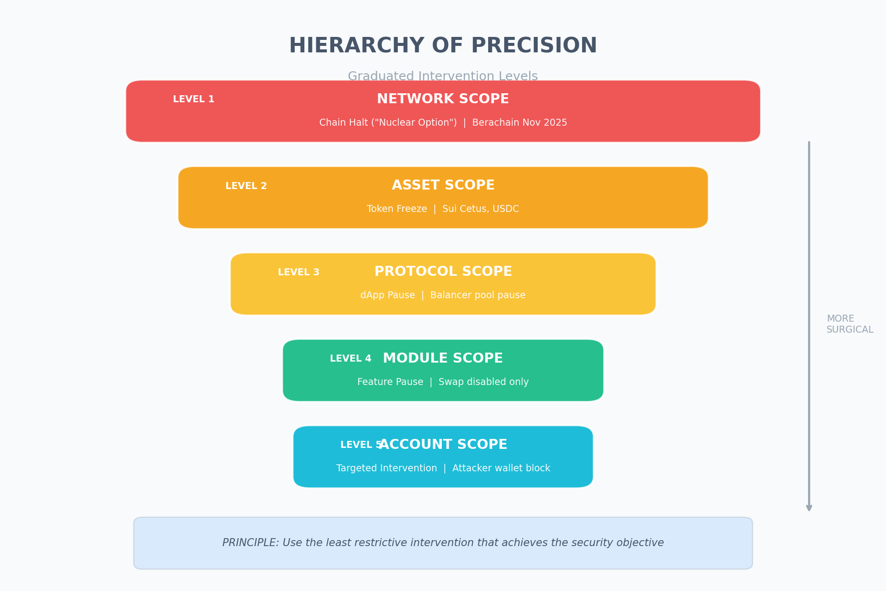
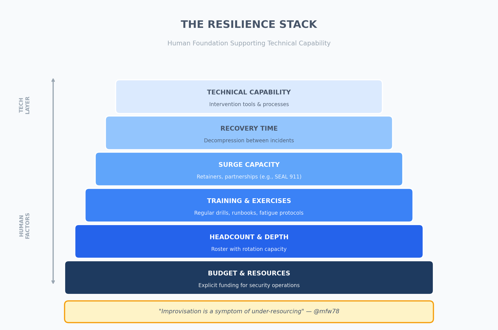

---

> **Response to Sebastian Bürgel (@SCBuergel)'s "A Framework for the Future" consultation**
>
> This document synthesises findings from the Native Compliance Framework (NCF) initiative to inform GnosisDAO's development of intervention criteria for its emergency framework. It offers a structured approach to the "credible neutrality vs. user safety" tension identified in the consultation.

---

## Executive Summary

The Balancer exploit (November 2025) and Gnosis Chain's response raised the need to define when and how intervention should occur: intervention capabilities exist, but no shared criteria exist for when to use them.

This framework proposes:

1. A Hierarchy of Precision for intervention scope (from "Nuclear Option" to surgical)
2. Legitimacy Conditions that must be satisfied for any intervention, and
3. A Procedural Framework aligned with GnosisDAO's governance values

**Key Claim:** Legitimate intervention is not the opposite of decentralisation but a formalisation of emergency powers that already exist but remain opaque or unclear, as a way of avoiding improvisational responses.

---

## Part 1: Problem Space

### 1.1 Scale of the Threat

Research from Charoenwong & Bernardi (2022) documents $88 billion in cryptocurrency losses (2011–2021), with the following distribution:

| Category | Incidents | % |
|:---------|:----------|:--|
| Security Breach | 20 | 66% |
| Human Error | 5 | 17% |
| Insider Theft | 5 | 17% |

**Post-2021 Update:** The NCF database now tracks 759 exploits totalling $91.3 billion (2014–2025).

### 1.2 Threats from AI Acceleration

The threat landscape has fundamentally shifted. Anthropic's December 2025 Red Team report reveals:

- AI agents can autonomously execute 55.8% of 2025 exploits
- Exploit revenue potential doubles every 1.3 months
- Cost per contract vulnerability scan: $1.22

The implication is that manual governance processes cannot keep pace with AI-accelerated attacks. Pre-defined intervention criteria that can be invoked rapidly are essential.

### 1.3 New Reality

A November 2025 analysis by Bybit's Security Lab examined 166 blockchains:

| Capability | Chains | % |
|:-----------|:-------|:--|
| Confirmed Freezing | 16 | 9.6% |
| Potential Freezing | 19 | 11.4% |
| No Freezing | 131 | 79% |

**Key Finding:** 21% of the market already has intervention capability. The question is not *whether* to intervene, but *how to do so legitimately*.

---

## Part 2: The Hierarchy of Precision

Current debate tends toward binary thinking (Halt vs. Nothing). This framework proposes a **graduated response spectrum**:

*Figure 1: The Hierarchy of Precision — graduated intervention levels from Network Scope (most disruptive) to Account Scope (most surgical).*

### Principle of Minimal Intervention

The least restrictive intervention that achieves the security objective should be preferred.

Example Analysis (Balancer Nov 2025):

- **Berachain** used Level 1 (Chain Halt) — effective but maximally disruptive
- **Sonic** used Level 5 (Account Freeze) — surgical but required rapid deployment
- **Optimal:** Pre-defined Level 4/5 capabilities with clear activation criteria

---

## Part 3: Legitimacy Conditions

Drawing on Charoenwong et al.'s "A Framework for Evaluating Regulatory Approaches to On-Chain Decentralised Software" (2025), five regulatory models can be identified:

| Model | Description | Authority |
|:------|:------------|:----------|
| Centralised | Direct government enforcement | Human |
| Gatekeeper | Delegated to intermediaries | Human |
| RegTech | Algorithmic monitoring | Algorithmic + Human |
| Ex Ante Automated | Rules enforce before execution | Algorithmic |
| Ex Post DeFi | Community governance after incident | Human |

For Gnosis, a hybrid of Models 3–4 is recommended: algorithmic detection with human governance for activation. This approach balances the speed and precision of automated systems with the accountability and legitimacy of human oversight.

### Legitimacy Test

*Figure 2: The four legitimacy conditions that must be satisfied for intervention to be considered valid.*

For any intervention to be considered legitimate, it should satisfy:

1. Transparency Condition
   - Intervention criteria are publicly documented *before* use
   - Decision-making process is visible to the community
   - Technical implementation is auditable

2. Proportionality Condition
   - Scope matches severity (Hierarchy of Precision)
   - Time-limited by default (sunset clauses)
   - Reversibility preserved where possible

3. Accountability Condition
   - Clear authority chain (who can trigger?)
   - Post-incident review required
   - Penalty for misuse (slashing, removal)

4. Due Process Condition
   - Affected parties can contest (within constraints)
   - Appeals mechanism exists
   - Evidence standards defined

### Decision Parameters

In the Gnosis Community AMA on 7 January 2026, Gnosis cofounder Friederike Ernst outlined specific factors the core team is considering for intervention decisions. Incorporating these parameters into the framework is strongly supported:

| Parameter | Description | Relevance |
|:----------|:------------|:----------|
| Exploit Type | What kind of attack occurred (reentrancy, oracle manipulation, access control, etc.) | Determines appropriate intervention level |
| Protocol Type | DeFi, bridge, NFT, infrastructure | Different risk profiles require different responses |
| Exploit Novelty | Known vulnerability vs. zero-day | Novel exploits may warrant faster response |
| Security Claims | What security guarantees did the protocol advertise? | Affects accountability assessment |
| Audit Status | Was the protocol audited? By whom? When? | Informs proportionality of response |
| Fund Percentage | What percentage of Gnosis Chain TVL is affected? | Higher impact justifies broader intervention |

These parameters should inform both the *trigger threshold* (when to intervene) and the *intervention level* (how broadly to intervene). The following are recommended:

1. Pre-defined thresholds for each parameter documented in the framework
2. Weighted scoring to combine multiple factors into a decision matrix
3. Transparent criteria published before any incident occurs

---

## Part 4: The Procedural Framework

### 4.1 Pre-Incident Phase

**Establish the Rules Before the Crisis**

*Figure 3: The pre-incident phase establishes intervention criteria through community ratification.*

Required Documentation:
- [ ] Intervention type definitions (Levels 1–5)
- [ ] Trigger conditions for each level
- [ ] Authority designation (multisig? quorum? node operators?)
- [ ] Time limits and sunset clauses
- [ ] Review and appeal procedures

### 4.2 Incident Response Phase

**An "Optimistic Freeze" Model**

*Figure 4: Optimistic Freeze model enables fast action with mandatory DAO ratification.*

Key Features:
- **Speed:** Emergency Council can act in minutes
- **Legitimacy:** DAO ratification required within 24–48h
- **Accountability:** If reverted, Council members may be subject to review

### 4.3 Post-Incident Phase

**Mandatory Transparency**

Every intervention requires:
1. Public Post-Mortem (within 7 days)
   - What happened
   - What intervention was taken
   - Why that level was chosen
   - Outcome and funds status

2. Community Review Period (14 days)
   - Open discussion on forum
   - Assessment of whether criteria were correctly applied
   - Proposals for framework amendments

3. Lessons Repository
   - Documented for future reference
   - Informs framework updates

---

## Part 5: Addressing the Colonial Critique

@mrtdlgc raised a valid concern about "legitimising censorship." This is taken seriously.

### Response:

1. Transparency is the Antidote to Colonialism
   - Colonial systems operate through hidden power structures
   - This proposal makes intervention criteria public and contestable
   - The community decides the rules rather than a select few

2. The Alternative is Worse
   - 21% of chains already have freezing capability, mostly undocumented
   - Without a framework, intervention happens anyway but without accountability
   - Gnosis is pioneering the path for a formalised system the industry can adopt or adapt

3. The Hierarchy Preserves Sovereignty
   - Level 5 (Account Scope) affects only proven attackers
   - Level 1 (Network Scope) requires highest justification
   - Proportionality limits scope by design

4. Community Governance Enables Accountability
   - GIP process = collective decision-making
   - Node operators can refuse to implement disputed changes
   - Fork remains the ultimate exit right

---

## Part 5.5: Organisational Resilience

Another important dimension is *human factors*. A framework is only as strong as the people executing it. This section draws from @mfw78's insights on aviation, nuclear power, and emergency medicine:

> "Improvisation is often a symptom of under-resourcing." — @mfw78

If GnosisDAO determines that intervention capability is appropriate, that capability needs to be *designed, resourced, and sustained*.

### The Resilience Stack

*Figure 5: The Resilience Stack shows human factors as the foundation supporting technical capability.*

### High-Reliability Industry Principles

| Factor | Requirement |
|:-------|:------------|
| Headcount | Sufficient depth to allow rotation during extended operations |
| Surge Capacity | Retainers, partnerships, or standby arrangements |
| Training | Regular exercises, documented runbooks, fatigue recognition |
| Recovery Time | Teams need decompression between incidents |
| Just Culture | Distinguish systemic failures from individual culpability |

### The Accountant's Question

If GnosisDAO wishes to maintain intervention capability, the cost should be budgeted explicitly:

- [ ] Internal headcount with appropriate depth
- [ ] External retainers or partnerships with security firms
- [ ] Comprehensive bug bounty programmes
- [ ] Training and exercises budget
- [ ] Recovery capacity: Time and resources for post-incident decompression

**Treating emergency response as an externality creates fragility.** Explicit budgeting enables informed resourcing decisions.

### Integration with the Framework

The proposed Emergency Council should:
1. Have defined roster depth (not just 3 people)
2. Include retainer agreements with external security firms (e.g., SEAL 911)
3. Conduct quarterly exercises (tabletop simulations)
4. Maintain explicit "fatigue protocols" for extended incidents
5. Conduct post-incident "just culture" reviews

---

## Part 6: Alignment with Gnosis Values

| Gnosis Value | How This Framework Supports It |
|:-------------|:-------------------------------|
| Credible Neutrality | Rules are defined *before* incidents, not during them |
| Transparency | All criteria, decisions, and post-mortems are public |
| Decentralisation | Emergency Council proposes; DAO decides; nodes execute |
| User Protection | Rapid response capability reduces loss exposure |
| Sustainability | Explicit resourcing prevents burnout and improvisation |

---

## Proposed Next Steps

### For GnosisDAO

1. Review this framework and provide feedback (this forum thread)
2. Integrate all or part of this proposed framework into the working framework by the current working group to refine criteria and procedures
3. Draft a GIP formalising the Intervention Framework
4. Establish Emergency Council composition and authority

---

## Data Sources & References

| Source | Description | Link |
|:-------|:------------|:-----|
| Charoenwong & Bernardi (2022) | $88B in losses (2011–2021) | [SSRN 3944435](https://ssrn.com/abstract=3944435) |
| Charoenwong et al. (2025) | A Framework for Evaluating Regulatory Approaches | [SSRN 5368708](https://ssrn.com/abstract=5368708) |
| Bybit Security Lab (Nov 2025) | 166 chains analysed | [Report](https://assets.contentstack.io/v3/assets/bltffdbacf2f22e15fa/bltda1597363a4f2a2b/69144b86424c333a34bc9fa8/2509-T68340_Security_Report_1111.pdf) |
| Anthropic Red Team (Dec 2025) | AI exploit capabilities | [red.anthropic.com](https://red.anthropic.com/2025/smart-contracts/) |
| NCF Repository | Research repository | [GitHub](https://github.com/e3o8o/native-compliance-framework) |

---

## Appendix: Glossary

| Term | Definition |
|:-----|:-----------|
| Ex Ante | Prevention before execution (vs. Ex Post = after) |
| Optimistic Freeze | Immediate pause, reverted if not ratified by DAO |
| Hierarchy of Precision | Graduated intervention levels (Network → Account) |
| Emergency Council | Designated multisig with authority to trigger pause |
| Credible Neutrality | Rules that do not favour any party, defined in advance |

---

**Contact:** @e3o8o (Forum) | [X/Twitter](https://x.com/elemoghenekaro) | [GitHub](https://github.com/e3o8o/native-compliance-framework)
