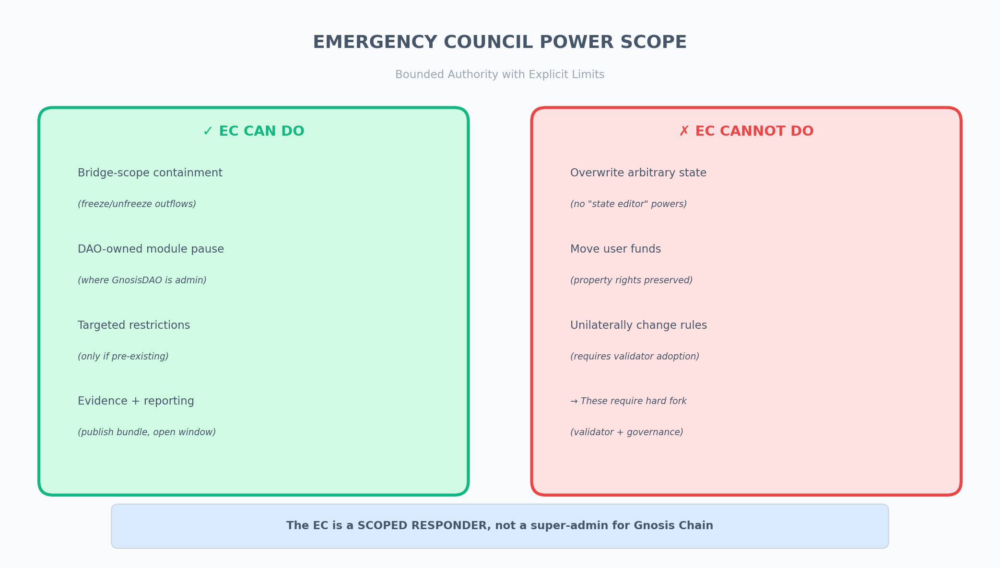
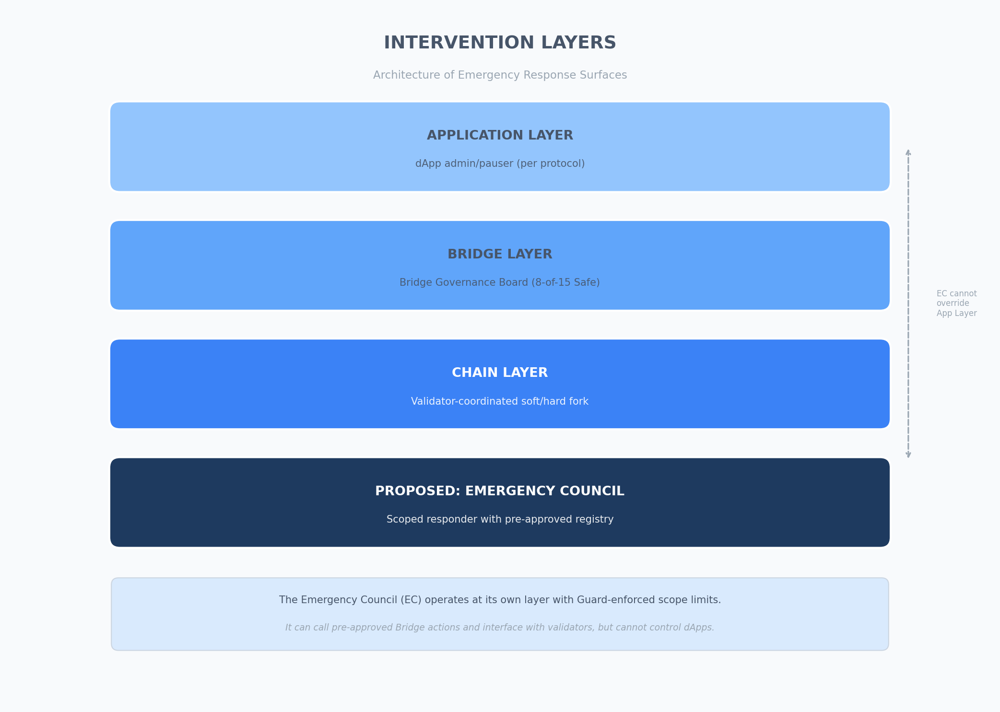
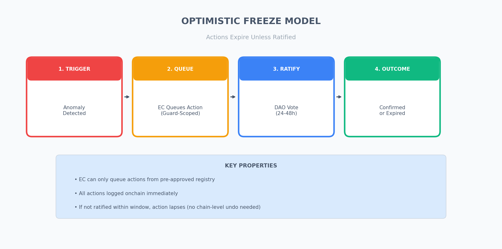

---

> **Technical Extension to the [Legitimate Intervention Framework (LIF)](https://github.com/e3o8o/legitimate-intervention-framework/blob/main/manuscript/gnosis_framework_response.pdf)**
>
> This document provides a technically grounded approach to defining the scope and limits of an Emergency Council for GnosisDAO. It addresses the core question: what powers should such a body have, and equally importantly, what powers should it explicitly *not* have?
>
> This is **Gnosis-specific** guidance, intended as a reusable template for other chains.

---

## Executive Summary

The core proposal remains unchanged: a **scoped intervention body** (the "Emergency Council") with pre-defined, narrowly bounded powers that **expire unless ratified** by the DAO.

This extension clarifies:

1. What powers are proposed (and what are explicitly excluded)
2. What intervention surfaces already exist on Gnosis Chain (Bridge Governance Board, validator coordination)
3. What the execution-layer spec implies about native chain-level capabilities
4. Concrete technical implementation paths (Safe Guards, protocol-level adoption)

**Key Claim:** The Emergency Council is not a "super-admin" for Gnosis Chain. It is a *scoped responder* operating within a pre-approved action registry.

---

## Part 1: Emergency Council Power Scope

*Figure 1: Emergency Council power scope defines what the EC can and cannot do.*

### 1.1 Proposed Powers (Bounded)

The Emergency Council (EC) should be able to execute **only pre-approved, narrowly defined emergency actions** that:

- Reduce ongoing harm (stop further extraction / laundering / bridging)
- Minimise blast radius (prefer targeted controls over broad halts)
- Expire by default (sunset unless explicitly extended/ratified)
- Leave an onchain audit trail

#### Acceptable EC Capabilities

| Scope | Capability | Precedent |
|:------|:-----------|:----------|
| Bridge-scope | Trigger pre-approved bridge outflow freezes | Bridge Governance Board (Nov 3, 2025) |
| Protocol-scope | Pause specific DAO-controlled modules (where GnosisDAO is admin) | DAO-owned infrastructure contracts |
| Account-scope | Initiate targeted transaction restriction (only if pre-existing mechanism adopted) | Requires governance + client adoption |
| Evidence + Reporting | Publish incident hash/evidence bundle; open ratification window | Public transparency |

### 1.2 Explicit Non-Powers

The EC should **not** have the ability to:

| Forbidden Action | Rationale |
|:-----------------|:----------|
| Arbitrarily overwrite chain state | No general "state editor" powers |
| Move user funds from arbitrary addresses | Property rights preserved |
| Unilaterally change protocol rules | Consensus/execution rules require validator adoption / fork |

**In other words:** The EC is not a super-admin for Gnosis Chain. It is a *scoped responder*.

---

## Part 2: Existing Intervention Surfaces on Gnosis Chain

*Figure 2: Intervention layers shows the architecture of emergency response surfaces on Gnosis Chain.*

### 2.1 Bridge Governance Board (BGB)

Gnosis already has an existing governance body with real emergency capability at the bridge layer.

| Property | Value |
|:---------|:------|
| Mechanism | Gnosis Safe multisig |
| Threshold | 8-of-15 |
| Ethereum Safe | `eth:0x42F38ec5A75acCEc50054671233dfAC9C0E7A3F6` |
| Gnosis Chain Safe | `gno:0x7a48Dac683DA91e4faa5aB13D91AB5fd170875bd` |
| Powers | Upgrades, limits, bridge signer/validator set adjustments (bridge contracts), bridge parameter changes |

**Precedent (Nov 3, 2025):** The BGB executed "Freeze outflow of major tokens on canonical bridges" following the Balancer V2 exploit. This is documented in the [Bridge Governance Decisions](https://docs.gnosischain.com/bridges/management/decisions).

**Key Takeaway:** Gnosis already uses a **scoped intervention body** at the bridge layer. The EC proposal is a formalisation and extension of this pattern.

### 2.2 Validator Coordination: Soft Fork and Hard Fork

Gnosis Chain demonstrated chain-level intervention via validator coordination during the Balancer incident:

| Intervention | Description | Timing |
|:-------------|:------------|:-------|
| Soft Fork | Targeted censorship of a single attacker address | Nov 2025 |
| Hard Fork | Validator adoption of new binaries to implement recovery path | Dec 22, 2025 |

The hard fork recovered approximately $9.4 million in frozen funds. This was executed after public governance discussion and coordination on the Gnosis forum (see [Balancer Hard Fork thread](https://forum.gnosis.io/t/balancer-hack-hard-fork/11884)).

**Key Takeaway:** Chain-level interventions exist, but they are not "EC-controlled" in the same way a Safe is. They require **validator adoption** and are inherently higher-friction.

### 2.3 Application-Level Admin

Many "pauses" are implemented at the dApp layer via upgradeable contracts / admin roles:

- If GnosisDAO is not the admin, GnosisDAO cannot pause the dApp.
- Example: Balancer's pool pause was executed by Balancer's governance, not GnosisDAO.

---

## Part 3: What the Execution-Layer Spec Implies

This section is a **negative capability check**: it confirms what Gnosis *does not* have by default at the protocol level.

### 3.1 Transaction Validity Path

Gnosis' `execution-specs` repository ([github.com/gnosischain/execution-specs](https://github.com/gnosischain/execution-specs)) tracks execution-layer behaviour. A transaction becomes invalid for reasons like:

- Insufficient gas / intrinsic cost
- Nonce mismatch
- Insufficient balance
- Invalid signature
- Fee market constraints

There is no address blacklist / denylist / admin override in the execution-layer spec. The checks are purely protocol-rule checks.

### 3.2 Interpretation

| Finding | Implication |
|:-------|:-----------|
| No native "admin can freeze address X" primitive | Any protocol-level address censorship/freeze requires client modifications, validator-coordinated soft/hard fork, or new system contract |
| Freezing logic is typically in txpool / validator code | Not in EVM transaction validity rules |
| Aligns with Bybit's taxonomy | "Hardcoded Lists" and "Configuration File" freezing are the most common patterns |

---

## Part 4: Technical Implementation Paths

### 4.1 Safe-Level Enforcement (Fastest, Least Invasive)

If EC actions are executed via a Gnosis Safe, Safe Guards and scoped allowlists can enforce that signers can only call pre-approved contracts/function selectors.

| Component | Function |
|:----------|:---------|
| Safe Guard | Smart contract that checks all transaction parameters before/after execution |
| Scoped Guard | Guard that restricts to pre-approved (contract, selector) pairs (allowlist-based) |
| Allowlist | Only permits transactions matching predefined recipients, function calls, or parameters |

**Implementation:** The "emergency action registry" can be implemented as a Guard that only allows calls to a specific set of (contract, selector) pairs.

**Tradeoff:** Only controls what the Safe can do. Does not change protocol rules.

### 4.2 Protocol-Level Enforcement (Reference Pattern)

Gnosis could, in principle, adopt a protocol rule where clients consult a DAO-controlled onchain contract for a denylist.

**Reference Pattern:**
- System contract at a precompile-like address
- Read methods: `getBlacklistedSenders()`, `getBlacklistedReceivers()`
- Admin methods: `addBlacklistedAddress(address)`
- Client behaviour: Nodes query the contract (ABI call), cache results, updates take effect without restarts

**Note:** This only works if client software treats the denylist contract as a **consensus rule** (deterministic from state), which requires a one-time network upgrade/hard fork to adopt.

**Tradeoff:** This is a major credible-neutrality decision. It becomes part of the chain's rule set and requires validator adoption.

### 4.3 Validator-Level Enforcement (Soft Fork / Hard Fork)

Gnosis has already demonstrated this path.

| Path | Description | Social Cost |
|:-----|:------------|:------------|
| Soft Fork | Validators agree to censor specific transactions | Medium (reversible, off-chain coordination) |
| Hard Fork | Validators update binaries to implement recovery/rule change | High (precedent risk, operational complexity) |

**Tradeoff:** Highest social cost, but also the only path for state-level interventions (e.g., fund recovery).

---

## Part 5: The "Optimistic Freeze" Model (Refined)

*Figure 3: Optimistic Freeze model — actions expire unless ratified within the challenge window.*

### 5.1 Key Properties

1. EC can only queue actions from the pre-approved registry
2. Actions are logged onchain immediately
3. DAO ratification is required within 24-48h
4. If not ratified, action lapses (does not need to be "undone" at chain level)

---

## Part 6: Recommended Next Steps

### For GnosisDAO

1. Adopt Safe Guard Pattern: Implement the "emergency action registry" as a Guard attached to the EC Safe
2. Define Allowlisted Actions: Document the specific (contract, selector) pairs the EC can call
3. Establish Ratification Timeline: Define the 24-48h window in the GIP
4. Consider Protocol-Level Path: If account-scope intervention is desired, initiate governance discussion on an onchain denylist contract (with full community debate on credible neutrality implications)

### For the Working Group

1. Integrate this technical grounding into the draft framework
2. Map the proposed EC powers to the Hierarchy of Precision (Levels 2-5)
3. Draft the Guard contract specification for audit

---

## Data Sources & References

| Source | Description | Link |
|:-------|:------------|:-----|
| Gnosis Chain Docs — Bridge Management | BGB threshold + Safes | [docs.gnosischain.com/bridges/management](https://docs.gnosischain.com/bridges/management/) |
| Gnosis Chain Docs — Governance Decisions | Bridge outflow freeze (Nov 3, 2025) | [docs.gnosischain.com/bridges/management/decisions](https://docs.gnosischain.com/bridges/management/decisions) |
| Gnosis Forum — Balancer Hard Fork | Soft fork + hard fork coordination | [forum.gnosis.io/t/balancer-hack-hard-fork/11884](https://forum.gnosis.io/t/balancer-hack-hard-fork/11884) |
| Gnosis Execution Specs | Execution-layer behaviour | [github.com/gnosischain/execution-specs](https://github.com/gnosischain/execution-specs) |
| Safe Documentation — Guards | Safe Guard and Module Guard specs | [docs.safe.global](https://docs.safe.global/) |
| Bybit Security Lab (Nov 2025) | 166 chains analysed, freezing taxonomy | [Bybit Report](https://assets.contentstack.io/v3/assets/bltffdbacf2f22e15fa/bltda1597363a4f2a2b/69144b86424c333a34bc9fa8/2509-T68340_Security_Report_1111.pdf) |
| LIF Repository | Full research repository | [github.com/e3o8o/legitimate-intervention-framework](https://github.com/e3o8o/legitimate-intervention-framework) |

---

## Appendix: Glossary (Extended)

| Term | Definition |
|:-----|:-----------|
| Emergency Council (EC) | Designated multisig with authority to trigger pre-approved emergency actions. |
| Bridge Governance Board (BGB) | Existing 8-of-15 multisig controlling Gnosis bridge operations. |
| Safe Guard | Smart contract that checks transaction parameters before/after execution. |
| Emergency Action Registry | Pre-approved list of (contract, selector) pairs the EC can call. |
| Optimistic Freeze | Immediate queue, expires unless ratified by DAO within challenge window. |
| Soft Fork | Validator-coordinated censorship of specific transactions. |
| Hard Fork | Validator-coordinated protocol rule change requiring binary update. |
| Credible Neutrality | Rules that do not favour any party, defined in advance. |

---

**Contact:** @e3o8o (Forum) | [X/Twitter](https://x.com/elemoghenekaro) | [GitHub](https://github.com/e3o8o/legitimate-intervention-framework)
