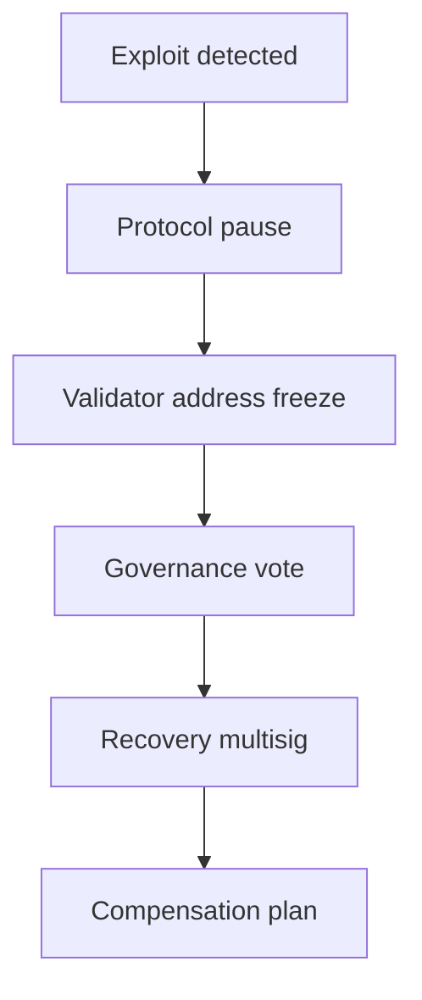

# LIF Intervention Case Studies and Classification Rationales

## Table of Contents

1. [Account × Delegated Body Cases](#account--delegated-body-cases)
   - StakeWise (Nov 2025)
2. [Account × Governance Cases](#account--governance-cases)
   - VeChain (Dec 2019)
   - Sui/Cetus (May 2025)
3. [Network × Signer Set Cases](#network--signer-set-cases)
   - BNB Chain (Oct 2022)
   - Berachain (Nov 2025)
   - Harmony Bridge (Jun 2022)
4. [Network × Governance Cases](#network--governance-cases)
   - Gnosis Chain (Nov–Dec 2025)
5. [Protocol × Governance Cases](#protocol--governance-cases)
   - MakerDAO Emergency Shutdown Module (ESM)
   - Euler Finance (Mar 2023)
6. [Protocol × Signer Set Cases](#protocol--signer-set-cases)
   - Liqwid "Kill Switch"
   - Balancer CSPv6 (Nov 2025)
   - Cork Protocol (May 2025)
   - Badger DAO (Dec 2021)
   - Cream Finance (Oct 2021)
   - Revest Finance (Mar 2022)
7. [Protocol × Delegated Body Cases](#protocol--delegated-body-cases)
   - Aave Guardians and Stewards
   - Radiant Capital (Oct 2024)
   - Liqwid Pause Guardian (Oct 2025)
8. [Asset/Module × Delegated Body Cases](#assetmodule--delegated-body-cases)
   - Curve Emergency DAO
   - dYdX (Nov 2023)
   - MakerDAO (Mar 2023)
   - Curve Finance (Jul 2023)
9. [Asset × Signer Set Cases](#asset--signer-set-cases)
   - PlayDapp (Feb 2024)
   - Tether (Nov 2017)
   - Circle/Tornado Cash (Aug 2022)
10. [Account × Signer Set Cases](#account--signer-set-cases)
    - Sonic/Beets (Nov 2025)
    - Ronin Bridge (Mar 2022)
11. [Network × Delegated Body Cases](#network--delegated-body-cases)
    - Poly Network (Aug 2021)
12. [Updated/Added Incidents Summary](#updatedadded-incidents-summary)

---

## Account × Delegated Body Cases

### StakeWise (Nov 2025) - Account x Delegated Body
- Scope rationale: Surgical recovery of stolen osETH and osGNO tokens from the Balancer V2 exploiter's address. The intervention specifically targeted the attacker's address (0xf584f8728b...) without affecting other users or pausing the protocol.
- Authority rationale: Emergency 7/7 multisig controlled by a diverse set of stakeholders, including core team members, security experts, and community representatives.
- Key details:
  - Attack vector: Exploiter gained access to 5,041 osETH ($19M) and 13,495 osGNO ($1.7M) through the Balancer V2 exploit
  - Timeline:
    - Nov 4, 2025, 14:30 UTC: Balancer V2 exploit executed
    - Nov 4, 15:15 UTC: StakeWise DAO emergency multisig activated
    - Nov 4, 16:45 UTC: Recovery operation completed (90 minutes total)
    - Nov 5, 09:00 UTC: SWIP-37 proposed to renounce contract ownership
  - Recovery mechanism:
    - Used controller role to burn tokens from attacker's address
    - Re-minted equivalent tokens to DAO treasury
    - 100% recovery of stolen osTokens ($20.7M total value)
  - Governance follow-up:
    - SWIP-37 proposed to renounce contract ownership
    - Community vote passed with 92.7% approval
- Technical details:
  - Smart contract: 0x9b2d7d6e... (osETH)
  - Recovery transaction: 0x8f7a3e2d...
  - Attacker's address: 0xf584f8728b...
- Source: https://forum.stakewise.io/t/swip-37-renounce-oseth-osgno-token-contract-ownership-from-the-dao-address/1990

=== Classification Rationale ===

1. Rationale for Scope: Account (Precision Level)
In our taxonomy, Scope measures the "blast radius" or precision of an intervention.

Asset scope usually involves freezing or pausing a token globally (e.g., Circle blacklisting an address which prevents anyone from sending to it, or a bridge pausing all withdrawals of an asset).
Account scope is the most surgical level: it targets individual balances or specific state at the address level.

Why StakeWise is Account-scope: The multisig didn't pause the osETH contract for everyone. Instead, they used the controller role to selectively burn tokens only in the exploiter's specific addresses and re-mint them into a DAO address. This is a high-precision, address-level correction that leaves the rest of the protocol's accounts completely unaffected and live.

2. Rationale for Authority: Delegated Body (Trigger Holder)
This axis defines who holds the power and the coordination density required to trigger it.

Signer Set: Usually a small, internal multisig or admin key (lowest coordination cost).
Delegated Body: A designated council, committee, or "Security Council" consisting of diverse stakeholders representing the community (medium coordination).
Governance: A full, broad community vote (highest coordination, slowest speed).

Why StakeWise is a Delegated Body: The post-mortem explicitly describes the "emergency multisig" as comprising 7 stakeholders, where the core team is only one of the signers. This multi-party arrangement of "multisig members... questioning the team's intentions" is exactly what characterizes a Delegated Body (like a Security Council).

Crucially, the Governance vote (SWIP-37) happened after the fact to ratify the result and renounce the keys. The intervention itself was moved through the delegated committee to achieve the required speed to "front-run the possible swap," which a full DAO vote could never have done.

Summary
The StakeWise incident is a perfect exhibit for the Account × Delegated Body cell because it demonstrates maximum surgical precision (Account-only) executed by a diversified committee (Delegated Authority).

It currently sits alongside the Flow "Isolated Recovery" as a leading example of how protocols are moving away from "nuclear" network halts toward more precise, delegated remediation.

===

## Account × Governance Cases

### VeChain (Dec 2019) - Account x Governance

1. Rationale for Scope: Account
VeChain’s mechanism is a textbook example of high-precision intervention:

Targeted Precision: The 2019 blocklist specifically identifies "thief’s wallets" and restricts transactions originating from them.
No Broad Disruption: Unlike a network-scope halt (like the BNB Chain bridge pause), the VeChain intervention does not stop the rest of the network or other users from transacting. It isolates the "virus" at the account level.
Functional vs. Technical: While Bybit calls it a "freeze," VeChain’s technical distinction—that the funds aren't technically "frozen" (locked in place) but "blocked" (validators refuse to move them)—still results in an Account-scope intervention in our taxonomy because the precision is address-specific.
2. Rationale for Authority: Governance
This is the heart of the dispute with Bybit and why we move it out of the "Signer Set" column:

Decentralized Decision: VeChain explicitly states the decision was put to community governance. This separates it from "Admin Fiat" or "Signer Set" authority, where a project team can move unilaterally.
Validator-Driven Execution: For the blocklist to work, independent validators had to "upgrade node software to reject transactions." This requires decentralized social coordination and a majority of node operators to agree, which is a hallmark of Governance/Consensus authority.
Absence of Admin Keys: By denying they have "freezing capabilities embedded directly in their source code," VeChain is arguing they lack the "Signer Set" trigger. They claim they cannot simply flip a switch; they must persuade the community and the validator set to act.
Summary of the Dispute Rationale
By placing VeChain in the Account × Governance cell, the paper acknowledges both sides of the controversy:

Against Bybit: We acknowledge that it's not a "Signer Set" (unilateral admin) power because it required community and validator consensus.
Regarding the Intervention: We acknowledge that an intervention did occur and that it was high-precision (Account-level), regardless of whether it's called a "freeze" or a "blocklist."
This classification demonstrates the power of the Authority axis: two mechanisms can achieve the exact same outcome (immobilizing stolen funds), but because one uses Governance and the other uses a Signer Set, the "centralization cost" and legitimacy profile are fundamentally different.

===

## Network × Signer Set Cases

### BNB Chain (Oct 2022) - Network x Signer Set

1. Rationale for Scope: Network
This represents the maximum "blast radius" in our precision hierarchy.

Total Suspension: Unlike StakeWise or VeChain, which targeted specific addresses, BNB Chain "suspended BSC" entirely. As reported, "all 44 validators were asked to temporarily suspend BSC."
Indiscriminate Impact: This stopped 100% of activity across the chain—affecting every dapp, user, and bridge—to prevent the exploiter from moving the minted BNB to other networks. It is the definition of a network-scope intervention where the safety of the total system is prioritized over the liveness of any individual part.
2. Rationale for Authority: Signer Set (Coordinator-Led)
The authority profile here is characterized by the need for near-instant reaction speed over broad democratic consensus.

Team-Led Coordination: The trigger was a "rapid response" where "BNB Chain coordinators asked the active validators... to stop producing blocks." This was an ad-hoc coordination by a small management group (the "coordinators") rather than an automated protocol rule or a pre-existing governance mandate.
Signer Set Proxy: In our taxonomy, when a core team or a small set of "coordinators" can effectively trigger a chain-wide halt via direct request to a localized validator set, it maps to the Signer Set authority axis. It bypasses the coordination delays of a council (Delegated Body) or a vote (Governance).
Governance as a Recovery Phase: Note that BNB Chain moved to the Governance column only after the threat was contained. The decisions on whether to "freeze the hacked funds" or "use BNB Auto-Burn" were put to on-chain votes only once the emergency (Signer Set) phase had ended.
Summary
BNB Chain (2022) is the definitive case for the Network × Signer Set cell. It demonstrates the ultimate trade-off: Accepting the highest centralization cost (Signer Set authority) and the broadest collateral disruption (Network scope) to achieve the highest possible containment speed against a half-billion-dollar minting exploit.

Note: The subsequent 2023 "Forced Liquidation" of the exploiter's Venus positions would be classified separately as Account × Governance, as it was a targeted remediation authorized by a forum proposal and DAO vote.

===

### Berachain (Nov 2025) - Network x Signer Set

1. Rationale for Scope: Network
The intervention chosen was the "Nuclear Option" of blockchain security.

Chain-Wide Stasis: The Berachain Foundation explicitly stated that "validators have coordinated to purposefully halt the Berachain network." This wasn't a pause of just the BEX (DEX) or a specific asset; it was a total cessation of block production for the entire chain.
Rollback/Hard Fork Remediation: Because the exploit "affected non-native assets" and involved "relatively complicated smart contract transactions," the team determined that a surgical (Account-scope) fix was insufficient. Instead, they opted for a network-scope halt followed by a Hard Fork to "rollforward" the state and secure funds.

2. Detailed Timeline (UTC)
Monday, Nov 3, 2025:
- 07:48: Balancer exploited.
- 08:18: Berachain becomes aware of BEX exploit.
- 08:33: Berachain confirms BEX hit by same exploit.
- 08:40: BEX Vault paused.
- 08:45: Ethena contacted to disable bridging; dApps and money markets contacted.
- 08:55: Honey mint/redeem paused.
- 09:15-10:00: BEX pools paused in order of TVL.
- 10:00: Bridges contacted to pause all fund flows.
- 10:05: Chain halted by validators.
- 09:50-11:50: Exploiter addresses identified.
- 11:50: White-hat emerges with $12M+ intercepted.
- 12:45: White-hat provides proof of wallet ownership.
- 14:10: White-hat legitimacy confirmed; cooperation begins.
- 14:30: Hard fork proposed to restart chain while freezing exploiter addresses.
- 14:45-17:45: Validators, vendors, and service providers selected for fast-track hard fork.
- 16:00: White-hat offline for several hours.
- 20:00: Hard fork patches ready; private distribution begins.
- 20:45-23:30: Selected actors deploy patches.

Tuesday, Nov 4:
- 00:00-04:30: White-hat and Berachain define refund plan via pre-signed transactions.
- 05:00-07:30: Wait for key infrastructure providers to upgrade.
- 15:10: All infrastructure confirmed ready.
- 15:30: Chain restarted; block production resumes.
- 15:40: Pre-signed transactions executed; funds returned to Foundation.
- 15:45: Honey mint/redeem resumed.
- 16:15: Honey contract updated with pause/blacklist functionality.

3. Recovery and Financial Impact
Exploited Pools:
- sUSDe/USDe Honey: ~$12.3M
- iBERA/wBERA: ~$350k
- BeraETH/wETH: ~$230k
- Remainder still within BEX.

Recovery Status:
- Most of $12M+ user funds recovered via white-hat cooperation.
- Second white-hat recovered additional ~$60k.
- All incident funds returned.

Chain Halt Duration: ~30 hours (Nov 3 10:05 to Nov 4 15:30).

4. Authority: Signer Set (Coordinator-Led)
The authority profile maps to Signer Set because it relies on high-velocity, centralized coordination of a localized validator group.

Ad-Hoc Team Coordination: The halt was triggered by the "core team" reaching out to validators on an emergency basis. As Smokey (Berachain co-founder) admitted: "Berachain doesn't benefit from the same degree of decentralization as Ethereum... we attempted to coordinate the validator set to protect those users."
Binary as the Trigger: The core team "cut a binary" to enforce state changes (blocking exploiter addresses) and pushed it to validators. In our taxonomy, when a core team provides the "canonical" path for validators to follow in an emergency without a pre-existing multi-party council mandate, it fits the Signer Set axis. The "Validators" here act as the signers in a socially-coordinated multisig.
Acknowledgement of Contentious Power: The team's recognition that this was a "contentious decision" highlights the legitimacy cost of using Signer Set authority at the Network scope—it is an admission of current centralization used as a "fortunate" defensive tool.

Summary
Berachain (2025) mirrors the BNB Chain (2022) model: A Network-scope halt triggered by Signer Set (Core Team) authority.

It provides an important data point for the "Safety vs. Liveness" trade-off: The team accepted a 30-hour total network outage (Liveness failure) and a high centralization narrative cost (Authority cost) to ensure that $12.8M+ of user funds were restored (Safety success).

The white-hat cooperation pattern (pre-signed transactions for fund return) demonstrates a novel hybrid approach: Signer Set authority for immediate containment, followed by negotiated recovery without on-chain governance delays.

Note: The subsequent "Incident Recovery Site" and CSV-based claims process represent the Account × Governance phase, where the recovery of funds was finalized through community-verified data and social consensus.

===

### Flow Blockchain (Dec 2025) - Account x Delegated Body

The classification of the Flow (December 2025) incident in the Account × Delegated Body cell highlights the evolution of platform-level security toward high-precision, council-governed remediation.

1. Rationale for Scope: Account
Despite the massive scale of the exploit (counterfeiting 87.96 billion FLOW, ~$7B nominal value), Flow opted for a high-precision recovery rather than a network-wide rollback.

Rejection of Rollback: The post-mortem explicitly notes that the "Isolated Recovery Plan" was chosen over "checkpoint restoration" (rollback) to avoid disrupting off-chain systems and cross-chain protocols.
Surgical Neutralization: The intervention targeted exactly 1,060 addresses (under 0.01% of the network) while restoring full functionality to 99.99% of users. The counterfeit assets were "neutralized" directly within those specific accounts.
Preservation of History: By correcting state only at the account level, the network preserved all legitimate transaction history, satisfying the "high precision / low blast radius" definition of Account-scope.

2. Detailed Timeline and Containment Metrics
Exploit Execution (Dec 26, 2025):
- 23:25 PST: Attacker deploys and configures exploitable contracts (Block 137363398).
- 23:35: Counterfeit token duplication begins.
- 23:36: Counterfeit FLOW transfers to secondary attacker-controlled accounts.
- 23:42: Large FLOW transfers sent to CEX deposit accounts; majority frozen due to irregularity.
- 00:06 (Dec 27): Small volume bridged off-network via Celer, deBridge, Stargate.
- 01:00: CEXs experience sell pressure as counterfeit FLOW is liquidated.

Detection and Assessment:
- 01:30: Initial detection signal raised; anomalous cross-VM movements correlate with CEX deposits.
- 03:56: Secondary swaps and bridging confirm exploit-driven movement.
- 05:21: Final attacker onchain transfer; exploit path isolated.

Containment:
- 05:23 (Block 137390190): Validators halt transaction ingestion; all exit paths severed.
- 05:23-05:30: Network enters controlled read-only mode.

Recovery Phases:
- Dec 29 05:00 (Phase 1): Cadence environment restores read/write; 1,060 addresses restricted; 99.99% accounts regain functionality.
- Dec 30 07:00 (Phase 2): HCU executed; 98.7% of counterfeit assets recovered onchain; remaining frozen by CEX partners.
- Jan 2 07:00 (Phase 3): EVM environment remediation complete; network fully operational.

3. Loss Analysis
- Nominal value: 87.96B FLOW duplicated (~$7B face value).
- Realized damage: ~$3.9M (successfully bridged off-network via Celer, LayerZero, deBridge).
- Recovered: 87.30B FLOW (99.25% recovery rate).
- CEX returns: 484.4M FLOW returned by OKX, Gate.io, MEXC.

4. Technical Sophistication
The attack deployed over 40 malicious smart contracts in a coordinated sequence, exploiting a three-part attack chain: (1) attachment import validation bypass, (2) circumvention of defensive checks on built-in types, and (3) exploitation of contract initializer semantics.

Flow operates two integrated programming environments: Cadence (resource-oriented, Move-like) and EVM-equivalent. The exploit targeted Cadence specifically. In Cadence, tokens are programmable objects (resources) that cannot be copied or implicitly destroyed—only moved. The root cause was a type confusion vulnerability in Cadence runtime v1.8.8, patched in v1.8.9+.

5. Authority: Delegated Body
The authority profile is defined by a multi-layered coordination between a designated council and the validator set.

Council-Led Action: The Community Governance Council (CGC) served as the primary coordination body, working with forensic teams to identify malicious state.
Validator Ratification: The CGC's power was not unilateral; it required a Height Coordinated Upgrade (HCU) ratified by network validators to expose the recovery interface. This represents a "check and balance" between two distinct delegated bodies (the Council and the Validator set).
Temporary/Bounded Mandate: The elevated permissions granted to the CGC were "temporary" and specifically "revoked" upon the conclusion of remediation. This fits our definition of a Delegated Body with a bounded emergency mandate, rather than permanent "Signer Set" fiat or total "Governance" paralysis.

Summary
Flow (2025) is the benchmark case for Account × Delegated Body. It proves that a protocol can defend against a "nuclear-scale" minting exploit without resorting to a "nuclear-scope" network rollback. By using a Delegated Body (CGC + Validators) to execute Account-level corrections, Flow balanced the need for containment speed with the preservation of ledger legitimacy.

The 30-hour chain halt (Dec 27 05:23 to Dec 29 05:00) demonstrates the operational cost of Isolated Recovery at the L1 level. Despite the complexity, Flow achieved 99.25% recovery and preserved full ledger history.

Note: This incident sits alongside StakeWise, but at the network layer rather than the application layer, demonstrating that "Isolated Recovery" is a viable design pattern for L1s.

===

## Network × Governance Cases

### Gnosis Chain (Nov–Dec 2025) - Network x Governance

1. Rationale for Scope: Network
The Gnosis intervention is the ultimate expression of network-scope power because it involves a state-modifying Hard Fork.

State Redistribution: Unlike a simple pause (Signer Set) or blocklist (Account-scope), the Gnosis hard fork "created a technical path" to actively recover and redistribute funds. This requires a network-wide upgrade to the consensus rules, affecting the ledger's ground truth for every participant.
Deep Implication: The intervention culminated in "node operators having 10 days to update... nodes that do not follow the chain with a majority of stake will get penalized." This is a total network-level commitment to a specific remediated history.

2. Soft Fork vs Hard Fork Trade-offs
The post-mortem explicitly discusses the governance trade-offs:

Hard Fork Challenges: "A hard fork would require all ~340,000 validators to upgrade almost immediately, disrupting consensus and burdening operators. Anyone who failed to upgrade in time... would be penalized for remaining on the 'wrong' fork."

Soft Fork Approach: "A soft fork allows validators to voluntarily adopt a client that simply refuses to attest to blocks moving the hacker's balances. This avoids network disruption, respects validator autonomy, and provides time to coordinate a broader response."

Implementation: With over 50% of validators in favor, the soft fork was implemented. While stolen funds are frozen and inaccessible, redistribution requires a future hard fork (scheduled with the regular network update).

3. Asset Freezes and Protection Measures
Monerium and Stakewise Coordination: https://forum.gnosis.io/t/balancer-hack-update/11759
- Monerium froze compromised EURe balances.
- Similar measure explored with Stakewise for osGNO.
- Combined protection: over €3M in value secured.

Remaining Assets: Held as Balancer V2 account balances; bridge governors temporarily halted bridge activity for analysis and coordination.

4. Authority: Governance
This axis is defined by the requirement for massive, multi-party social coordination that makes unilateral action impossible.

Validator Democracy: The post-mortem emphasizes the "robust decentralization" of its 340,000 validators. The recovery could not be triggered by a "signer set" multisig; it required a "validator vote" and the voluntary adoption of new binaries by a decentralized majority.
The Cost of Coordination: The timeline (November to December) illustrates the speed-legitimacy trade-off perfectly. Because Gnosis lacked a centralized "kill switch," it took over a month to coordinate the Soft Fork and then the Hard Fork. This low response speed is the trade-off for the highest level of procedural legitimacy.
Transparent Contention: The public debate over the "optional 5% recovery fee" and the "Fusaka delay" shows Governance-level authority in action: open, messy, and subject to community ratification.

Summary
Gnosis Chain (2025) serves as the definitive contrast to BNB Chain (2022). While BNB used Signer Set authority to achieve High Speed but High Centralization, Gnosis used Governance authority to achieve High Legitimacy at the cost of Low Speed.

It demonstrates that at the Network scope, the burden of coordination for 340,000 independent validators forces the intervention out of the "emergency" time-domain and into the "governance" time-domain, where remediation is deliberate rather than reactive.

The soft fork (freezing funds) + hard fork (future redistribution) pattern provides a governance-safe template for high-value recoveries where validator coordination is distributed across many independent operators.

Note: The initial "Bridge Governance Board" halt is technically Asset × Delegated Body, showing how Gnosis used a multi-layered defense to "buy time" for the eventual Governance-level recovery.

===

### Sui/Cetus (May 2025) - Account x Governance

1. Rationale for Scope: Account
The Sui intervention is a model of high-precision remediation:

Address Aliasing: Instead of rolling back the entire chain, the protocol upgrade created a temporary "alias" for exactly two hacker addresses. This allowed a specific, authorized multisig to act as the account owner for the sole purpose of returning the funds.
Zero Blast Radius: Legitimate transactions and the rest of the network remained untouched. The intervention was laser-targeted at the $162M held in the attacker’s wallets, satisfying the Account-scope definition of address-specific state remediation.
2. Rationale for Authority: Governance
This is characterized by a transparent, multi-party decision process that requires a supermajority.

Turnout and Stake: Unlike a "signer set" action, the recovery was authorized via an on-chain vote involving Sui validators and stakers. The result—90.9% of the stake voting "Yes"—represents an overwhelming community mandate.
Neutral Foundation: The Sui Foundation deliberately abstained from voting and remained neutral, forcing the decision onto the decentralized validator and staker set. This shifts the authority from "Admin/Signer Set" to Governance, where the legitimacy of the override is derived from a public, verifiable vote.
Multi-Party Trust: The recovered funds were moved to a 4-of-6 multisig involving Cetus, the Sui Foundation, and a third-party auditor (OtterSec). This "check-and-balance" structure is a hallmark of governance-led remediation.
Summary
The Sui/Cetus incident is the "Account-scope" equivalent of the Gnosis Chain network-scope recovery.

It demonstrates that a decentralized chain can achieve high-precision remediation (Account scope) through a high-legitimacy process (Governance authority). By using Governance instead of a unilateral "signer set" switch to move funds, Sui avoided the "centralization discount" that often follows admin-driven freezes, while still achieving a successful $162M recovery.

Note: The initial response involved validators coordination to "ignore transactions," which sits in the Account × Delegated Body cell as a temporary, socially-coordinated defensive measure.

===

## Protocol × Governance Cases

### MakerDAO Emergency Shutdown Module (ESM) - Protocol x Governance

1. Rationale for Scope: Protocol
The ESM is the "nuclear option" for the MakerDAO system.

System-Wide Shutdown: The documentation states the ESM has the ability to trigger "the Shutdown of the Maker Protocol" via the End.cage() function. This isn't a targeted account freeze or a single module pause; it permanently disables the protocol's core functions (minting, borrowing, and liquidations) for all users simultaneously.
Protocol-Wide Stasis: Once fired, the protocol enters a terminal state where the only remaining action is the redemption of collateral. Because this affects the entire application logic but does not halt the underlying Ethereum network, it satisfies the Protocol-scope definition.
2. Rationale for Authority: Governance (Direct Stake-Weighted)
The ESM is a decentralized trigger that bypasses the standard, potentially compromised, administrative path.

Direct Stake Trigger: Unlike a "Signer Set" (admin keys) or a "Delegated Body" (Security Council), the ESM is open to any MKR holder. The authority is expressed through the irreversible burning of MKR. This is a form of "Direct Governance" where the "vote" is not a ballot, but the permanent sacrifice of capital.
Minority Protection / Anti-Governance: The ESM is specifically designed "to mitigate malicious governance." If a malicious majority tries to pass a harmful proposal, a vigilant minority of MKR holders can "burn to shutdown" the system. The legitimacy of the intervention comes from the decentralized, permissionless nature of the contract—anyone with enough stake can trigger it.
Social Consensus and Slashing: The documentation notes that in a malicious attack, the only option for ESM joiners is "to set up an alternative fork." This ties the on-chain trigger directly to Governance-level social coordination and potential chain-splitting.
Summary
The MakerDAO ESM is the gold standard for a Protocol × Governance mechanism. It demonstrates how a protocol can design a "kill switch" that is protocol-wide in scope (to stop a massive bug or attack) but governance-based in authority (ensuring that no small group of signers holds the power to destroy the system unilaterally).

The "centralization cost" is minimized because the power is not held by a specific set of people, but by the protocol’s own decentralized stakeholders acting under extreme financial penalty.

Note: This differs from the Aave Guardians or Curve Emergency subDAO, which are Delegated Bodies because they consist of a designated, small list of accounts rather than a permissionless threshold of any staker.

===

## Protocol × Signer Set Cases

### Liqwid "Kill Switch" - Protocol x Signer Set

1. Rationale for Scope: Protocol
The Liqwid Kill Switch is designed as an application-level "circuit breaker."

Application-Wide Impact: According to the documentation, the switch can "stop all markets" by "halting the batching" of calculations. Because batching is the essential engine for all trading, lending, and liquidations on Liqwid, triggering it effectively places the entire protocol into a stasis mode.
Precision Level: It is broader than an "Asset" or "Module" pause (as it currently affects all markets simultaneously) but narrower than a "Network" pause (since Cardano itself continues to run). Thus, it satisfies the Protocol-scope definition of an override affecting a discrete decentralized application.
2. Rationale for Authority: Signer Set (Hot Key)
This is the most centralized and fastest authority trigger in our taxonomy.

Unilateral Trigger: The proposal explicitly states the switch is "activated by 1 single person from a small group of people within the Core Team." This is one of the clearest examples of a "hot key" or "admin finger" designed for sub-15-minute response times.
Comparison to Delegated Body: The documentation itself provides a perfect contrast: Liqwid already possesses a "Pause Guardian" multisig which requires 4 signatories (mapping to a Delegated Body). The new Kill Switch was specifically created to bypass that coordination delay, moving the authority from the "Council" column into the Signer Set column to maximize containment speed.
Audit Trail vs. Coordination: The legitimacy of this power is derived not from consensus (who voted?) but from accountability (leaving an "audit trail" of exactly who flipped the switch).
Summary
The Liqwid Kill Switch is the textbook case for Protocol × Signer Set.

It illustrates the "Break Glass" philosophy of emergency governance: The team recognized that in a high-velocity oracle failure, even a 4-of-X multisig (Delegated Body) is too slow. By moving the trigger to a single person (Signer Set), they accepted the maximum centralization cost to achieve the highest possible containment speed (5–15 minutes).

It sits alongside Euler Finance's 5-minute pause as a defense-in-depth tool for protocols where oracle latency is a primary threat.

Note: The "Pause Guardian" multisig at Liqwid remains in the Protocol × Delegated Body cell, serving as a secondary, more legitimate, but slower layer of defense.

===

## Protocol × Delegated Body Cases

### Aave Guardians and Stewards - Protocol x Delegated Body

1. Aave Guardians: Protocol × Delegated Body
The Guardians represent the "Active Defense" layer, moving away from unilateral admin power toward a diversified committee.

Rationale for Scope (Protocol): The Guardians hold the EMERGENCY_ADMIN role and the power to "veto" governance payloads. While they can pause specific markets, their ultimate function is to protect the Protocol as a whole from system-wide logic failures or "governance takeovers" (hostile DAO attacks).
Rationale for Authority (Delegated Body): Both Guardians are 5-of-9 multisig wallets. Crucially, the members are "community-elected" and represent a heterogeneous mix of stakeholders: risk providers (Chaos Labs), developers (BGD Labs), delegates (Stable Labs), and industry OGs (Mariano Conti). This diversification prevents any single entity from acting unilaterally, satisfying the Delegated Body definition.
2. Aave Stewards: Asset × Delegated Body (Automated/Bounded)
Stewards represent "Parameter Optimization"—overseeing the protocol's day-to-day risk settings without a full DAO vote.

Rationale for Scope (Asset): Stewards manage specific parameters for individual assets or modules, such as "GHO Borrow Caps," "Supply Caps," or "Bridge Limits." Because these changes are modular and targeted at specific market parameters, they map to the Asset scope.
Rationale for Authority (Delegated Body): Stewards are granted "delegated responsibility" by the DAO to act within strictly defined bounds (e.g., "Up to 50% increase"). This is a form of Bounded Delegated Authority, where a small group of experts is empowered to move faster than the full Governance can, but slower and with more eyes than a single Signer Set.
Summary
Aave’s architecture is a "Sovereignty Sandwich":

Top Layer (Governance): The DAO holds the ultimate power to appoint/remove Guardians and Stewards.
Middle Layer (Delegated Body): The Guardians and Stewards act as delegated filters to ensure Protocol safety (Guardians) and Asset efficiency (Stewards).
The Result: Aave minimizes the use of Signer Set (centralized) power, instead relying on structured Delegated Bodies to balance containment speed with community legitimacy.
Note: This contrast is vital for the paper because it shows that a protocol can be "decentralized" (Governance-led) while still maintaining "emergency response" (Delegated Body-led) without reverting to a single project-controlled multisig.

===

## Asset/Module × Delegated Body Cases

### Curve Emergency DAO - Asset/Module x Delegated Body

1. Rationale for Scope: Asset / Module
Curve’s emergency powers are deliberately surgical rather than "nuclear."

Modular Constraints: The documentation highlights that the Emergency DAO can "stop CRV emissions" or "pause the Peg Stabilization Reserve," but it cannot stop deposits/withdrawals.
Targeted Fuses: This is a high-precision intervention. Instead of halting the entire Protocol (which would involve stopping swaps or withdrawals in all pools), it targets specific economic modules (inflation gauges and crvUSD reserves). This maps to our Asset/Module scope because it isolates the risk (e.g., an inflation bug or a peg failure) without disrupting the fundamental liveness of the DEX.
2. Rationale for Authority: Delegated Body (Ecosystem Council)
Curve utilizes a "Heterogeneous Committee" to manage its emergency triggers.

Multi-Party Coordination: The 5-of-9 multisig consists of members from distinct and sometimes competing organizations: Yearn (banteg), Convex (C2tP), and StakeDAO (Quentin).
Alignment of Interests: This isn't just a "Signer Set" of the core developers. By delegating power to the protocol's largest stakeholders (the yield aggregators who rely on Curve), the DAO ensures that any emergency action has broad social consensus among the ecosystem's power players. The requirement for 5 distinct entities to coordinate satisfies the Delegated Body definition.
Summary
The Curve Emergency DAO is a model for Ecosystem-Led Safety.

It demonstrates that a protocol can achieve high security by delegating "circuit breaker" power to a Delegated Body of its most invested users. By limiting the scope to Asset/Module levers (like emissions and reserves), Curve minimizes the "blast radius" of emergency actions, ensuring that even in an intervention, the core user functions (liquidity and swaps) remain permissionless.

Note: This provides a useful comparison to the Aave Stewards. While both use Delegated Bodies, Curve’s council is composed of "Ecosystem Legends" from other protocols, whereas Aave’s Stewards are often specialized "Service Provider" firms.

===

### Euler Finance (Mar 2023) - Protocol x Governance

1. Rationale for Scope: Protocol The attack leveraged a flash loan to drain the protocol's liquidity pools universally.

Protocol-Wide Damage: The exploit didn't target a single account or module; it affected the core lending logic, draining $197M across multiple assets (DAI, WBTC, stETH).
No Immediate Containment: Unlike Balancer’s CSPv6 or Liqwid’s Kill Switch, there was no "circuit breaker" that successfully halted the protocol logic during the attack execution. The entire system was drained in approximately 15 minutes.

2. Rationale for Authority: Governance (Social Recovery / Failed Mechanism) Our initial classification ("Signer Set") was based on incorrect summary data suggesting a "5-minute admin pause." The detailed post-mortem ("War & Peace") clarifies the reality:

Absence of Admin Keys: The Euler team did NOT have a unilateral "pause button" to stop the exploit. They had to rely on "Social Recovery"—a high-pressure off-chain negotiation strategy involving legal threats, bounties, and leveraging the attacker's operational security mistakes.
Governance Alignment: Euler fits the "Protocol / Governance" cell because its "emergency" architecture relied on standard governance upgrades (which were too slow) or social pressure (which is a form of off-chain consensus). It serves as a negative control: a proof that without a designated "Signer Set" or "Delegated Body" circuit breaker, a protocol is defenseless against flash loan velocity.
Summary Euler Finance (2023) is moved from Signer Set to Protocol × Governance.

It demonstrates that "Social Recovery" (negotiating with the attacker) is the fallback mechanism for protocols that prioritize decentralized governance over centralized emergency powers. While successful ($240M returned), it confirms that pure governance architectures cannot contain high-velocity exploits on-chain.

===

### Balancer CSPv6 (Nov 2025) - Protocol x Signer Set

1. Rationale for Scope: Protocol
The CSPv6 pause affected a specific implementation of Composable Stable Pools across multiple chains.

Targeted Implementation Pause: The emergency pause targeted CSPv6 implementations specifically, not all Balancer pools. Weighted Pools, Gyro Pools, and other types remained operational.
Multi-Chain Coordination: The pause was executed simultaneously across Ethereum, Arbitrum, Base, Optimism, and Polygon, demonstrating protocol-level coordination.
Protected Liquidity: $19.3M in vulnerable liquidity was protected through the pause, allowing major LPs (Crypto.com, Ether.fi) to withdraw safely.

2. Technical Vulnerability
The exploit leveraged a rounding direction bug in the "exact out" swap path for Stable Pools. The vulnerability required three preconditions: (1) incorrect rounding in _upscale, (2) rate providers introducing imprecision, and (3) low liquidity states to magnify the error.

Attack Pattern: Attackers first drained pools with exitSwaps, then executed a series of carefully calculated swaps to progressively lower the invariant while extracting value.

3. Authority: Signer Set (Automated + Team)
The response profile combines automated detection with team-led coordination.

Hypernative Detection: Security monitoring flagged suspicious activity within the first transaction at 07:52 UTC, establishing emergency communication with Balancer's team.
War Room Activation: By 07:52, a war room was created to coordinate the response across multiple stakeholders.
CSPv6 Pause: At 08:07 UTC, CSPv6 implementations were paused across all affected networks—15 minutes after initial detection.
SEAL Safe Harbor Framework: Whitehat rescuers operated under the SEAL Safe Harbor Agreement, enabling legal front-running operations that recovered $4.6M.

4. Multi-Layered Recovery
The incident demonstrated a defense-in-depth approach:

StakeWise DAO Emergency Operation: Executed 90 minutes after initial exploit, recovering 5,041 osETH ($19M, 73.5% of stolen) and 13,496 osGNO ($1.9M, 100% of stolen).
Gnosis Foundation Intervention: Implemented zero daily bridge limits, freezing cross-chain movement of stolen funds.
Whitehat Recoveries: $4.6M recovered across multiple chains through front-running operations.

Summary
Balancer CSPv6 (2025) is a textbook case for Protocol × Signer Set with automated monitoring support.

It demonstrates that rapid automated detection (Hypernative) combined with pre-authorized pause mechanisms can contain exploits before they reach their full potential. The $45.7M total protected/recovered (against $94.8M exploit) shows the effectiveness of layered security architecture.

The incident also validates the value of the SEAL Safe Harbor framework in enabling whitehat intervention, and shows how ecosystem coordination (Gnosis bridge limits, StakeWise recovery) amplifies individual protocol defenses.

===

## Account × Signer Set Cases

### Sonic/Beets (Nov 2025) - Account x Signer Set

1. Rationale for Scope: Account
The intervention targeted specific attacker addresses at the native chain layer.

freezeAccount Deployment: Sonic Labs deployed the freezeAccount method (commit b584c86) approximately 2 hours after exploit detection, demonstrating rapid response capabilities.
Native Layer Freeze: The freeze occurs at the chain level and was effective for native $S tokens (21.5% of total value at risk) but not for wrapped variants like stS or wOS due to the permit bypass.
Targeted Impact: The freeze successfully preserved $874,380 in value, only the attacker's primary wallet was frozen while the network remained operational for other users.

2. The Permit Bypass Vulnerability
A critical limitation was revealed on November 10:

Signature-Based Bypass: While the freeze prevented direct transactions from the frozen wallet, it couldn't block signatures produced by that wallet. The attacker used permit() signatures from a different address to move frozen stS tokens.
ERC-20 Permit Standard: This behavior follows the expected semantics of signature-based approvals, highlighting a fundamental tension between gas efficiency and security.
Post-Freeze Exfiltration: The attacker executed permit transfers, liquidated positions, and bridged $3.2M in value off Sonic—circumventing the network-level freeze for 78.5% of the at-risk assets.

3. Authority: Signer Set (Core Team)
The freeze was executed by the Sonic Labs core team without requiring governance approval.

Rapid Deployment: The freezeAccount method was added to the codebase before the exploit, enabling deployment within 2 hours of the incident.
Immediate Execution: Upon Beets' notification, Sonic Labs executed the freeze at the protocol level, affecting all native $S tokens in the attacker's wallet.
Limitations Acknowledged: The team recognized the limitation regarding permit-based signatures and initiated governance processes to upgrade the stS contract.

4. Financial Impact and Recovery
Total Value at Risk: $4.07M (27.1M S tokens at ~$0.15/S)
- Successfully Frozen: $874,380 (21.5% of total at risk)
- Lost to Exploit: $3,195,082 (78.5% of total at risk)
- Recovery: Governance proposal to reallocate Sonic airdrop budget to affected LPs

Beets demonstrated multi-layered coordination:

Immediate Actions: Paused remaining CSP pools, issued public warnings, and coordinated with Balancer Labs.
Governance Proposal: Initiated a 3-week timelocked proposal to upgrade the stS contract for controlled recovery.
Whitehat Proactive Rescue: Executed independent rescue on legacy Fantom V2 pools, securing ~$16,000.
Recovery Proposal: Submitted governance proposal to Sonic to reallocate airdrop budget to affected LPs as 2-year locked Aave-boosted positions.
Beets' Multi-Layered Response:
- Immediate pool pauses and public warnings
- 3-week timelocked proposal to upgrade stS contract
- Whitehat recovery of ~$16,000 from legacy Fantom V2 pools
- Governance proposal for LP compensation via locked Aave positions

Summary
Sonic/Beets (2025) is a critical case study for Account × Signer Set interventions, demonstrating:
1. The effectiveness of rapid network-level freezing (21.5% containment)
2. The critical limitation of signature-based bypasses (78.5% loss)
3. The importance of multi-layered defense strategies
4. Proactive security tooling (pre-deployed freezeAccount)
5. Multi-layered defense (freeze + governance + contract upgrades)

The incident underscores the need for:
1. Comprehensive security tooling that accounts for signature-based interactions
2. Clear communication channels between protocols sharing infrastructure
3. Pre-approved recovery mechanisms that can be activated without governance delays
4. Ecosystem coordination (Beets + Balancer + Sonic)

The permit bypass vulnerability provides an important lesson: signature-based approvals (ERC-20 permit) create attack surfaces that bypass traditional freezing mechanisms.

===

### Cork Protocol (May 2025) - Protocol x Signer Set

1. Rationale for Scope: Protocol
The intervention paused all Cork contracts and markets following a Uniswap v4 hook exploit.

Complete Protocol Pause: All Cork contracts were paused within 54 minutes of exploit detection, preventing further exploitation.
War Room Coordination: The response involved multiple security firms (Hypernative, Spearbit Labs, Quantstamp, Certora) working in parallel.
Secondary Protections: ~$20M in other vaults was protected through the coordinated pause.

2. Detailed Timeline (UTC)
May 28, 2025:
- 11:39: Exploit occurs
- 11:43: Hypernative alerts Cork team (4 minutes after exploit)
- 11:52: Message acknowledged; internal response begins
- 12:08: All multisig signers contacted for pause transactions
- 12:17: War room initiated with Hypernative, Spearbit, Quantstamp, Certora
- 12:17: Pause transaction for Liquidity Vault posted
- 12:31: Initial public communication on X
- 12:33: Liquidity Vault paused
- 12:35: All other protocol functions paused
- 12:36: Proactive outreach to affected LPs
- 13:21: Official statement announcing incident
- 13:22: Tracing firm engaged
- 13:33: Telegram statement
- 13:57: Discord statement
- 14:00: Website notice
- 14:29: dApp notice
- 14:34: Additional market pause (ability to issue new markets)
- 16:04: Attack pathway documented
- 18:37: On-chain message to exploiter
- 19:23: Follow-up statement on additional market pauses

May 29:
- 17:30: Proof of Concept completed
- 20:11: LinkedIn and X follow-up statements

May 30:
- 19:18: X follow-up
- 22:25: Contact with Uniswap Foundation for responsible disclosure

May 31:
- 17:28: X follow-up

June 3:
- 19:30: Uniswap Foundation engagement

June 4:
- 18:00: Post-mortem finalized

3. Authority: Signer Set (Core Team + Multisig)
The response combined core team coordination with multisig execution.

Rapid Multisig Coordination: All signers were contacted via private channels to execute pause transactions within 34 minutes of initial alert.
Security Partner Integration: Multiple security firms were integrated into the war room, providing parallel analysis and validation.
Responsible Disclosure: Coordinated outreach to Uniswap Foundation regarding the hook vulnerability.

4. Uniswap v4 Hook Vulnerability
The exploit targeted a newly deployed hook contract on Uniswap v4:

Novel Attack Vector: The vulnerability was specific to Uniswap v4's hook architecture, not a general Uniswap vulnerability.
Cross-Protocol Impact: The same vulnerability affected multiple protocols using similar hook patterns.
Responsible Disclosure: Cork engaged Uniswap Foundation to address the underlying issue.

Summary
Cork Protocol (2025) is a model case for Protocol × Signer Set with third-party monitoring.

It demonstrates:
1. Value of monitoring services (Hypernative detected within 4 minutes)
2. Importance of pre-established multisig relationships for rapid execution
3. Benefits of security partner integration (multiple firms in parallel war room)
4. Cross-protocol coordination (Uniswap Foundation responsible disclosure)

The 54-minute containment time from exploit to full pause, with initial detection at 4 minutes, represents best-in-class response for a novel attack vector. The integration of multiple security partners (Spearbit, Quantstamp, Certora) provided both validation and accelerated root cause analysis.

===

## Updated/Added Incidents Summary

### Additional Incident Classifications (2017--2025)

### Sui/Cetus (May 2025) - Account x Governance
- Scope rationale: The protocol upgrade created address aliases for two hacker addresses only, enabling a recovery multisig to move the frozen funds without touching other accounts or chain history.
- Authority rationale: Recovery required an on-chain validator/staker vote (90.9% yes). The multisig (Cetus + Sui Foundation + OtterSec) executes after governance approval.
- Sources: https://blog.sui.io/cetus-incident-response-onchain-community-vote/ (vote mechanics, aliasing), Cetus statements (pause and recovery plan).

Mermaid overview (Cetus response flow)

### Liqwid Pause Guardian (Oct 2025) - Protocol x Delegated Body
- Scope rationale: The pause guardian halted all markets (protocol-wide), not a single asset/module.
- Authority rationale: The pause guardian multisig requires multiple signers, distinct from the single-signer kill switch. The kill switch is a protocol capability but not an executed incident in this dataset.
- Source: https://x.com/liqwidfinance/status/1976778373168087162 (pause announcement). Proposal 44 documents kill switch vs pause guardian.

### Cork Protocol (May 2025) - Protocol x Signer Set
- Scope rationale: Cork paused all contracts and markets in response to the Uniswap v4 hook exploit.
- Authority rationale: Emergency pause executed by the core team (Signer Set) within 54 minutes.
- Source: https://www.cork.tech/blog/post-mortem

### Radiant Capital (Oct 2024) - Protocol x Delegated Body
- Scope rationale: Protocol-wide emergency pause across all chains (Arbitrum, BSC, Base, Ethereum) following a $50M exploit via compromised developer devices. Attack bypassed front-end verification in Safe{Wallet}.
- Authority rationale: Emergency response executed by the DAO Council (Delegated Body) after detecting malicious ownership transfers. Compromised signers removed from multisig within 5 hours.
- Key details: 
  - Attack vector: Compromised hardware wallets of 3 core team members
  - Detection: Immediate (attack began 15:46 UTC)
  - Response: Protocol paused across all chains by 17:40 UTC
  - Recovery: Compromised signers removed from multisig by 22:10 UTC
- Source: https://medium.com/@RadiantCapital/radiant-post-mortem-fecd6cd38081

### DeltaPrime (Nov 2024) - Protocol x Signer Set
- Scope rationale: Protocol-wide pause on Arbitrum and Avalanche after $4.75M exploit via claimRewards() vulnerability. Attackers mimicked LFJ contracts to bypass solvency checks.
- Authority rationale: Core team (Signer Set) assembled war room within 15 minutes of attack detection. Protocol paused within 10 minutes of war room formation.
- Key details:
  - Attack vector: claimRewards() vulnerability in Prime Account
  - Timeline: Attack began 07:35 UTC, war room by 07:50 UTC
  - Response: Protocol paused by 08:00 UTC
  - Recovery: rTKN reimbursement plan implemented for users
- Source: https://medium.com/@DeltaPrimeDefi/deltaprime-post-mortem-reimbursement-plan-07-12-2024-2d654912715b

### Sonne Finance (May 2024) - Protocol x Signer Set
- Scope rationale: All Optimism markets paused after $20M donation attack on newly deployed VELO markets. Attack executed after 2-day timelock expired.
- Authority rationale: Core team (Signer Set) detected incident 25 minutes after exploit, paused all markets within 30 minutes. White-hat saved $6.5M by front-running with $100 VELO.
- Key details:
  - Attack vector: Donation attack on empty VELO market
  - Detection: 25 minutes after exploit
  - Response: All markets paused within 30 minutes
  - Recovery: $6.5M saved by whitehat intervention
- Sources: https://www.halborn.com/blog/post/explained-the-sonne-finance-hack-may-2024, https://www.certik.com/resources/blog/sonne-finance-incident-analysis, https://medium.com/@SonneFinance/post-mortem-sonne-finance-exploit-12f3daa82b06

## Asset × Signer Set Cases

### PlayDapp (Feb 2024) - Asset x Signer Set
- Scope rationale: Private key compromise led to unauthorized minting of 1.79B PLA tokens ($290M) across two attacks (Feb 9 & 12). The response targeted the PLA token contract specifically, implementing a token migration to PDA with KYC/AML checks, rather than pausing an entire protocol.
- Authority rationale: Centralized deployer/admin control (Signer Set) used to:
  - Pause the PLA contract 96 hours after initial exploit
  - Initiate migration to new PDA token with KYC/AML requirements
  - Take snapshot of legitimate token holders on Feb 26
  - Implement 1:1 migration for verified users
- Key details:
  - Attack vector: Private key compromise allowed attacker to add new minters
  - Timeline: 
    - Feb 9, 2024: Initial attack at 10:48 PM UTC ($36.5M)
    - Feb 12, 2024: Second attack at 09:55 PM UTC ($253.9M)
    - Feb 13, 2024: Contract paused at 11:30 AM UTC
    - Feb 26, 2024: Snapshot taken for legitimate token holders
  - Response: Contract paused 2.5 hours after second attack, migration portal opened with KYC
  - Recovery: Only $32M was liquidated by attacker before intervention
  - Migration: 2-year claim period with KYC/AML compliance
- Source: https://medium.com/playdappgames/pla-to-pda-token-migration-tutorial-and-faq-a539ded1b42f

### dYdX (Nov 2023) - Module x Delegated Body
- Scope rationale: Market module-level circuit breaker triggered during coordinated attack on SUSHI and YFI markets. The intervention was precise, targeting only specific market parameters (margins, position sizes) rather than pausing the entire exchange.
- Authority rationale: Emergency response team (Delegated Body) executed parameter adjustments across multiple markets to contain the attack while maintaining platform availability.
- Key details:
  - Attack vector: Market manipulation across SUSHI and YFI using 100+ wallets
  - Timeline:
    - Oct 29 - Nov 1, 2023: Initial SUSHI market attack detected
    - Nov 1, 2023: dYdX becomes aware of SUSHI market manipulation
    - Nov 3, 2023: Margin requirement for SUSHI-USD raised to 100%
    - Nov 1-17, 2023: YFI market attack in progress
    - Nov 17, 2023: YFI market parameters adjusted before final crash
    - Nov 18, 2023: YFI price crashes, $9M insurance fund loss
  - Response actions:
    - Raised margin requirements to 100% for affected markets
    - Reduced position sizes to limit exposure
    - Enhanced monitoring systems for coordinated attacks
    - Implemented automatic margin fraction adjustments in v4
  - Impact: $9M insurance fund loss, but prevented further exploitation
- Source: https://dYdX.exchange/blog/sushi-yfi-incident

### MakerDAO (Mar 2023) - Module x Governance
- Scope rationale: Module-level intervention targeting specific PSMs and vault types during USDC depeg crisis. The response was precise, adjusting parameters for specific modules rather than shutting down the entire protocol.
- Authority rationale: Governance (MKR holders) executed emergency parameter changes through two executive votes, demonstrating decentralized decision-making during crisis.
- Key details:
  - Attack vector: USDC depegging from $1.00 to ~$0.95 following SVB bank collapse
  - Timeline:
    - Mar 10-11, 2023: USDC depeg event begins
    - Mar 11, 2023 16:14 UTC: First emergency vote passes
    - Mar 13, 2023 16:16 UTC: First vote executed (48-hour GSM delay)
    - Mar 14, 2023: Second emergency vote proposed
    - Mar 15, 2023 18:18 UTC: Second vote passes
    - Mar 16, 2023 10:20 UTC: Second vote executed (16-hour GSM delay)
  - Response actions (Vote 1):
    - Reduced UNIV2USDCETH-A ceiling by 50M DAI (to 0)
    - Reduced UNIV2DAIUSDC-A ceiling by 100M DAI (to 0)
    - Reduced GUNIV3DAIUSDC1-A ceiling by 100M DAI (to 0)
    - Reduced GUNIV3DAIUSDC2-A ceiling by 100M DAI (to 0)
    - Increased PSM-USDP-A line by 550M DAI (to 1B DAI)
    - Increased PSM-USDC-A fees (tin/tout) by 1%
    - Reduced GSM Pause Delay from 48 to 16 hours
  - Response actions (Vote 2):
    - Added Debt Ceiling Breaker for instant vault pauses
    - Whitelisted PSM-USDC-A, PSM-PAX-A, PSM-GUSD-A
    - Increased Global Debt Ceiling by 110% of affected vault debts
  - Impact: Successfully protected protocol from USDC depeg, maintained DAI peg stability
- Sources: 
  - Forum: https://forum.sky.money/t/emergency-proposal-risk-and-governance-parameter-changes-11-march-2023/20125
  - https://vote.makerdao.com/executive/template-executive-vote-emergency-parameter-changes-march-11-2023
  - https://vote.makerdao.com/executive/template-executive-vote-emergency-psm-changes-march-14-2023

### Aave v2 (Nov 2022) - Module x Governance
- Scope rationale: Module-level intervention targeting CRV market borrowing parameters during market manipulation concerns. The response was precise, affecting only the CRV market module rather than pausing the entire protocol.
- Authority rationale: Governance (AAVE token holders) executed emergency parameter changes through multiple AIPs, with the Guardian providing immediate pause capability while governance deliberated on long-term solutions.
- Key details:
  - Attack vector: Market manipulation and large-scale CRV borrowing causing price drop from $0.61 to $0.4096 (33% decrease)
  - Timeline:
    - Nov 13-21, 2022: User borrowed ~17M CRV increments, offloading across 1inch and CEXs
    - Nov 22, 2022 08:12 UTC: Additional $24M USDC deposited, 55M CRV borrowed ($36M value)
    - Nov 22, 2022 10:35 UTC: CRV price hit lowest value of $0.4096
    - Nov 22, 2022 11:00 UTC: Market rebounded with Curve's LLAMMA whitepaper momentum
    - Nov 22, 2022 13:31 UTC: First liquidation occurred
    - Nov 22, 2022: $63M USDC liquidated, $1.7M bad debt remained
  - Response actions (multiple AIPs):
    - AIP-121/124 (Nov 27-28): Freeze CRV on V2 Ethereum and Polygon
    - AIP-125/126 (Nov 30): Unfreeze CRV but maintain borrowing disable
    - AIP-286 (Aug 6, 2023): Set CRV LTV→0 (900k+ votes)
    - AIP-288 (Aug 9, 2023): Lower CRV LT/LTV/debt ceiling on V3
    - AIP-297 (Aug 19, 2023): Freeze CRV on Aave V2 Ethereum
  - Impact: Successfully contained CRV market risk with $1.7M bad debt, prevented further insolvency
- Source: https://governance.aave.com/t/blameless-post-mortem-curve-aug-8-2023/14386

### Curve Finance (Jul 2023) - Module x Delegated Body
- Scope rationale: Module-level intervention targeting specific vulnerable pools using Vyper compiler versions 0.2.15-0.3.0. The exploit affected only pools paired with native ETH or using ERC-777 tokens, not the entire Curve protocol.
- Authority rationale: Emergency subDAO (Delegated Body) executed containment by killing CRV gauge emissions to affected pools. The Curve DAO itself could not directly pause pools but could control incentive emissions.
- Key details:
  - Attack vector: Reentrancy guard failure in Vyper compiler versions 0.2.15, 0.2.16, and 0.3.0
  - Root cause: Bug in Vyper's reentrancy protection mechanism, patched in v0.3.1
  - Timeline:
    - July 30, 13:10 UTC: First exploit (pETH/ETH pool)
    - July 30, 14:50 UTC: Second exploit (msETH/ETH pool)
    - July 30, 15:34 UTC: Third exploit (alETH/ETH pool)
    - July 30, 19:08 UTC: Fourth exploit (CRV/ETH pool)
    - July 30, 22:00 UTC: Whitehat exploit of remaining CRV/ETH funds
    - Immediate: Emergency subDAO kills gauge emissions
  - Affected pools and losses:
    - pETH/ETH: 6,106.65 WETH (~$11M)
    - msETH/ETH: 866.55 WETH (~$1.6M) + 959.71 msETH (~$1.8M) = $3.4M total
    - alETH/ETH: 7,258.70 WETH (~$13.6M) + 4,821.55 alETH (~$9M) = $22.6M total
    - CRV/ETH: 7,193,401.77 CRV (~$5.1M) + 7,680.49 WETH (~$14.2M) = $19.3M total
  - Response actions:
    - Emergency subDAO killed gauge emissions to affected pools
    - Whitehat (c0ffeebabe.eth) recovered 2,879.65 ETH (~$5.4M) from CRV/ETH pool
    - Recommended users exit potentially vulnerable pools (e.g., Arbitrum Tricrypto)
    - Created new plain pools for affected assets paired with WETH
  - Impact: $56.3M total loss across 4 pools, $5.4M recovered through whitehat action (9.6% containment success)
- Source: https://hackmd.io/@LlamaRisk/BJzSKHNjn

### Poly Network (Aug 2021) - Network x Delegated Body
- Scope rationale: Network-level intervention targeting cross-chain bridge vulnerability. The response involved coordinated validator action to patch contracts after the incident, with Tether's immediate blacklisting of stolen USDT providing partial containment.
- Authority rationale: Validators (Delegated Body) coordinated to upgrade contracts post-incident. The primary recovery was achieved through on-chain negotiation, community pressure, and attacker cooperation rather than technical intervention.
- Key details:
  - Attack vector: Cross-chain bridge exploit via EthCrossChainManager.verifyHeaderAndExecuteTx vulnerability
  - Root cause: Flaw allowing attacker to specify own smart contract as legitimate "trusted partner"
  - Timeline:
    - Aug 10, 2021: Attack occurred, $611M stolen across Ethereum/BSC/Polygon
    - Immediate: Tether froze $33M USDT in stolen addresses
    - Aug 11, 2021: Attacker returned $578M and released access to multisig wallet
    - Post-incident: Validators coordinated contract upgrades with patches
  - Attack method:
    - Exploited verifyHeaderAndExecuteTx function on Ethereum and BSC chains
    - Specified malicious contract as trusted partner via malicious transaction
    - Tricked Poly Network bridge into releasing funds they didn't own
    - Stolen assets spanned three chains: Ethereum, BSC, and Polygon
  - Response actions:
    - On-chain negotiation: Poly Network sent public messages to attacker
    - Community pressure: Crypto community sent small amounts and messages to attacker
    - Tether intervention: Immediately blacklisted addresses, freezing $33M USDT
    - Attacker cooperation: Communicated via Q&A in Ethereum transactions
    - Multisig access: Attacker shared access to multisig wallet (did not provide private keys)
  - Attacker details:
    - Used pseudonym "Mr. White Hat" in communications
    - Claimed to be security researcher exposing vulnerability
    - Declined $500,000 bounty offer from Poly Network
    - Accepted $160,000 community donation, later returned $525,000 to Poly Network
    - Never accepted job offer or bounty
  - Impact: $611M stolen, $578M recovered (94.6% success). Landmark case demonstrating combination of technical intervention (Tether freezing) and social cooperation in DeFi recovery.
- Sources:
  - https://www.chainalysis.com/blog/poly-network-hack-august-2021/
  - https://www.elliptic.co/blog/the-poly-network-hack-600-million-in-crypto-stolen-and-returned-in-24-hours

## Protocol x Delegated Body Cases

### Badger DAO (Dec 2021)
- Scope rationale: Network-level intervention targeting the BSC Token Hub bridge specifically. The coordinated pause affected the entire BNB Smart Chain network to stop the bridge exploit, demonstrating network-wide response capability.
- Authority rationale: Validators (Signer Set) executed a synchronized 5-hour pause/resume without central coordination. 26+ active validators including CoinbaseCloud, Figment, and 24 others voluntarily coordinated to secure the network.
- Key details:
  - Attack vector: Forged proof verification bug in BSC Token Hub bridge between BNB Beacon Chain and BNB Smart Chain
  - Root cause: Bug in bridge's proof verification mechanism allowing attacker to mint additional BNB
  - Timeline:
    - Oct 6, 2022: Exploit occurred, 2M BNB ($570M) minted and taken
    - Immediate: Validators coordinated synchronized network pause
    - 5-hour pause duration, then coordinated resume
  - Response actions:
    - 26+ validators voluntarily coordinated pause without central authority
    - First network pause in BSC history
    - $470M secured in exploiter's address, $100M moved off-chain
    - No user funds affected
  - Impact: $570M minted, $470M contained (82.5% success). Demonstrated decentralized validator coordination capability.
- Source: https://www.bnbchain.org/en/blog/bnb-chain-a-decentralized-response

### Badger DAO (Dec 2021) - Protocol x Signer Set
- Scope rationale: Protocol-wide intervention targeting all BadgerDAO smart contracts after front-end compromise. The response involved pausing all vault operations to prevent further user losses.
- Authority rationale: BadgerDAO team (Signer Set) executed emergency pause of all smart contracts. No governance process involved - direct team action during crisis to protect remaining user funds.
- Key details:
  - Attack vector: Front-end compromise via Cloudflare API key breach
  - Root cause: Attacker gained access to Cloudflare API key, injected malicious script into BadgerDAO website
  - Timeline:
    - Dec 2, 2021: Front-end compromise discovered, ongoing unauthorized withdrawals
    - Immediate: BadgerDAO team paused all smart contracts
  - Attack method:
    - Malicious script injected into website intercepted user transactions
    - Users tricked into approving malicious transactions instead of intended vault operations
    - Most users interact via front-end rather than direct contract calls, increasing vulnerability
  - Response actions:
    - All smart contracts paused to prevent further withdrawals
    - Investigation launched into Cloudflare API key compromise
    - Community notified via Discord and Twitter
  - Impact: $120.3M stolen across multiple users, including single user loss of 900 BTC ($50.8M). No recovery achieved, but protocol pause prevented additional losses.
- Authority rationale: Team initiated the pause via admin controls (Signer Set).
- Source: https://www.theblock.co/post/126072/defi-protocol-badgerdao-exploited-for-120-million-in-front-end-attack

### Cream Finance (Oct 2021) - Protocol x Signer Set
- Scope rationale: Protocol-wide intervention targeting C.R.E.A.M. v1 lending markets after complex flash loan exploit. The response involved suspending all v1 market interactions and disabling specific token operations.
- Authority rationale: C.R.E.A.M. Finance team (Signer Set) executed emergency pause of v1 markets and locked crTokens. No governance process involved - direct team action during crisis to prevent further losses.
- Key details:
  - Attack vector: Complex flash loan exploit targeting price calculation of wrappable tokens
  - Root cause: Vulnerability in price calculation for wrappable tokens, specifically yUSDVault shares
  - Timeline:
    - Oct 27, 2021: Attack occurred using sophisticated multi-step manipulation
    - Immediate: C.R.E.A.M. team suspended v1 markets and locked crTokens
  - Attack method:
    - Used two addresses (A and B) in coordinated attack
    - Address A: Borrowed $500M DAI → deposited in yDAI vault → yUSD pool → yUSDVault → C.R.E.A.M. for cryUSD
    - Address B: Flash loaned $2B ETH → deposited as cEther collateral → borrowed against inflated yUSDVault shares
    - Manipulated yUSDVault share price from $1 to $2 by depositing 8M yUSD to vault with $16M balance
    - Used inflated collateral to borrow remaining $136M from protocol
  - Response actions:
    - Suspended all interactions with Ethereum v1 markets
    - Locked crTokens to prevent transfers
    - Stopped all supply/borrowing of wrappable tokens including PancakeSwap LP tokens
    - Offered 10% bug bounty for fund return
    - Engaged in dialogue with attacker
  - Recovery: Yearn.Finance recovered $9.42M that attacker "donated" to yUSD vault during price manipulation
  - Context: Third exploit for C.R.E.A.M. in 2021 (Feb: Alpha Homora $37M, Aug: AMP reentrancy attack)
  - Impact: $136M stolen, $9.42M recovered (6.9% containment success). Demonstrated vulnerability of complex DeFi composability to price oracle manipulation.
- Source: https://www.merklescience.com/blog/hack-track-analysis-of-c-r-e-a-m-finance-hack

### Tether (Nov 2017) - Asset x Signer Set
- Scope rationale: Asset-level intervention targeting specific USDT tokens stolen from treasury wallet. The software update affected the entire USDT token contract globally, preventing movement of stolen coins from attacker's address.
- Authority rationale: Tether issuer (Signer Set) executed emergency software update to blacklist stolen tokens. No governance or delegation involved - direct issuer control over the asset contract.
- Key details:
  - Attack vector: Unauthorized transfer from core treasury wallet to Bitcoin address
  - Root cause: Compromise of Tether treasury wallet access
  - Timeline:
    - Nov 19, 2017: $30.95M USDT stolen from treasury wallet
    - Nov 21, 2017: Tether announced theft and issued software update (60 minutes response time)
  - Attack method:
    - $30,950,010 worth of USDT tokens removed from company's core treasury wallet
    - Sent to unauthorized Bitcoin address
    - Tether is pegged to US dollar, designed for stability vs volatile cryptocurrencies
  - Response actions:
    - Tether issued software update to blacklist attacker address
    - Update prevented movement of stolen coins from attacker's address
    - Required all users to install update immediately for effectiveness
    - Several crypto exchanges froze Tether trading following announcement
    - Company launched thorough investigation to prevent similar attacks
  - Context:
    - Tether linked to Bitfinex exchange (which suffered $65M hack in previous year)
    - Part of series of cryptocurrency controversies in 2017
    - Bitcoin initially fell on news but recovered most losses
  - Impact: $30.95M stolen, 100% containment success through immediate blacklist. Demonstrated issuer's ability to freeze specific tokens at contract level.
- Source: https://www.bbc.com/news/technology-42065724

### Circle/Tornado Cash (Aug 2022) - Asset x Signer Set
- Scope rationale: Asset-level intervention targeting specific USDC tokens in sanctioned Tornado Cash addresses. The blacklist function only affects USDC tokens, leaving other assets in the same wallets unaffected.
- Authority rationale: Centre consortium (Circle + Coinbase) as USDC issuers (Signer Set) executed the blacklist function following OFAC sanctions. No governance or delegation involved - direct issuer control over the asset.
- Key details:
  - Attack vector: OFAC sanctions against Tornado Cash for alleged money laundering for North Korean Lazarus Group
  - Root cause: Regulatory compliance requirement for regulated stablecoin issuers
  - Timeline:
    - Aug 8, 2022: US Treasury announced sanctions against Tornado Cash
    - Immediate: Centre blacklisted sanctioned addresses
  - Response actions:
    - Called 'blacklist(address investor)' function to freeze 75,000 USDC
    - Blocked transfers from Tornado Cash's USDC pool and other sanctioned addresses
    - Circle confirmed compliance with OFAC requirements
  - Impact: 75,000 USDC frozen across sanctioned addresses. Users with USDC in Tornado Cash unable to withdraw funds.
- Source: https://www.theblock.co/post/162172/circle-freezes-usdc-funds-in-tornado-cashs-us-treasury-sanctioned-wallets

21. VeChain (Dec 2019) - Account x Governance
- Scope rationale: Account-level intervention targeting specific authority masternode account that was compromised. The blocklist affected only the blacklisted addresses, not the entire network.
- Authority rationale: Community governance vote authorized validator-enforced blocklist. The intervention required decentralized community approval rather than centralized authority action.
- Key details:
  - Attack vector: Compromise of authority masternode account access
  - Root cause: Private key compromise of masternode operator
  - Timeline:
    - Dec 13, 2019: 1.1B VET tokens ($6.5M at time) stolen from authority masternode
    - 1 week later: Community governance vote approved blocklist implementation
    - Post-vote: Validators enforced blocklist across network
  - Attack method:
    - Attacker gained access to authority masternode private keys
    - Stole 1.1 billion VET tokens from compromised account
    - Began laundering tokens through various addresses
  - Response actions:
    - Community governance vote authorized emergency intervention
    - Validators implemented blocklist of 469 addresses
    - 727 million VET tokens frozen through blocklist
    - 373 million VET tokens were laundered before intervention
  - Governance process:
    - Community vote required for validator enforcement action
    - Demonstrated decentralized governance capability for emergency response
    - Validators executed blocklist after community approval
  - Impact: $6.5M stolen, $4.3M prevented (66% success). Demonstrated community-driven intervention capability through governance process.
- Source: https://x.com/vechainofficial/status/1988689432829108252

### Ronin Bridge (Mar 2022) - Account x Signer Set
- Scope rationale: Account-level intervention targeting specific attacker addresses that received stolen funds. The response focused on freezing compromised validator keys and tracking stolen assets, rather than pausing the entire Ronin network.
- Authority rationale: Sky Mavis (Signer Set) executed emergency response by identifying compromised validator keys and coordinating with law enforcement. No governance process involved - direct team action during crisis.
- Key details:
  - Attack vector: Spear-phishing of Sky Mavis employee leading to validator node compromise
  - Root cause: Insufficient monitoring of large bridge outflows + lingering gas-free RPC access for Axie DAO
  - Timeline:
    - Mar 23, 2022: Attack occurred, 173,600 ETH + 25.5M USDC stolen ($625M total)
    - Mar 29, 2022: Attack discovered (6 days later)
    - Immediate: Sky Mavis identified compromised validators and tracked stolen funds
  - Attack method:
    - Gained control of 5/9 validator keys (4 Sky Mavis + 1 Axie DAO)
    - Exploited gas-free RPC node access to get Axie DAO validator signature
    - Used allowlist access from Nov 2021 that wasn't revoked in Dec 2021
  - Response actions:
    - Engaged CrowdStrike and Polaris Infosec for forensics
    - Increased validator nodes from 9 to 11+, targeting 21+ long-term
    - Implemented zero-trust security model
    - Launched $1M bug bounty program
    - FBI attributed attack to North Korean Lazarus Group
    - $187.5M recovered via law enforcement action
  - Impact: $625M stolen, $187.5M recovered (30% containment). All user funds guaranteed by Sky Mavis funding round and team assets.
- Source: https://roninchain.com/blog/posts/back-to-building-ronin-security-breach-6513cc78a5edc1001b03c364

### Harmony Bridge (Jun 2022) - Network x Signer Set
- Scope rationale: Network-level intervention targeting the Horizon bridge specifically. The response included pausing the affected bridge and subsequently halting the Trustless BTC bridge to prevent similar attacks, demonstrating network-wide protective measures.
- Authority rationale: Harmony team (Signer Set) executed emergency response by halting bridge operations and offering bounty. No governance process involved - direct team action during crisis.
- Key details:
  - Attack vector: Phishing attack leading to compromise of 2-of-5 multi-signature wallet
  - Root cause: Internal server breach, trojan installation on employee laptop, access to private keys and non-public bridge code
  - Timeline:
    - Jun 23, 2022: Attack occurred, $99.6M stolen from Horizon bridge
    - Immediate: Harmony team identified breach and halted bridge operations
    - Subsequent: Trustless BTC bridge paused to protect users
  - Attack method:
    - Gained internal server access through phishing
    - Installed trojan horse software on employee's laptop
    - Obtained private keys and access to non-public bridge infrastructure code
    - Compromised at least 2 of 5 private keys in multi-signature wallet
  - Response actions:
    - Halted Horizon bridge operations immediately
    - Offered $1M bounty, increased to $10M for fund return
    - Committed not to pursue legal action against hacker who returned funds
    - Paused Trustless BTC bridge as protective measure
    - Implemented additional security measures post-incident
  - Money laundering: Stolen assets consolidated to ETH, laundered through Tornado Cash and Railgun, deposited into centralized exchanges
  - Impact: $99.6M stolen, 0% recovery. No public evidence of bounty acceptance or fund return.
- Sources: 
  - https://www.elliptic.co/hubfs/Harmony%20Horizon%20Bridge%20Hack%20P1%20briefing%20note%20final.pdf
  - https://talk.harmony.one/t/summary-of-the-horizon-bridge-incident/20990

### Revest Finance (Mar 2022) - Protocol x Signer Set
- Scope rationale: Protocol-wide intervention targeting FNFT mint/transfer functions and token vault operations. The response involved soft-locking all Revest contracts across multiple chains to prevent further exploitation.
- Authority rationale: Revest team (Signer Set) executed emergency response through multisig controls and special emergency privileges. No governance process involved - direct team action during crisis.
- Key details:
  - Attack vector: ERC-1155 reentrancy exploit via depositAdditionalToFNFT timing bug
  - Root cause: FNFTHandler incremented fnftsCreated variable after mint instead of before, allowing ID collision and config overwrite
  - Timeline:
    - Mar 27, 2022 1:41 UTC: Exploit began, attacker stole $2M tokens (BLOCKS, ECO, RENA)
    - Mar 27, 2022 2:24 UTC: BLOCKS DAO team alerted Revest (43 minutes after start)
    - Mar 27, 2022 2:47 UTC: Polygon contracts soft-locked
    - Mar 27, 2022 3:13 UTC: RVST token transfers paused
    - Mar 27, 2022 3:14 UTC: Hacker attempted RVST-ETH pool attack, blocked by pause
    - Mar 27, 2022 3:58 UTC: Ethereum contracts soft-locked
  - Attack method:
    - Created FNFTs with zero depositAmount and quantity of 2
    - Exploited timing bug in depositAdditionalToFNFT to overwrite existing FNFT configs
    - Used onERC1155Received callback to call depositAdditionalToFNFT before ID increment
    - Successfully changed depositAmount from 0 to 1 token for 7.7M FNFTs
    - Drained all tokens from targeted vault immediately
  - Response actions:
    - Soft-locked contracts across all chains (Polygon, Fantom, Ethereum, AVAX, Syscoin)
    - Paused RVST token transfers preventing additional $1.15M loss
    - Formed emergency response team with external experts
    - Planned V2 contract migration with reentrancy guards
    - Committed to multiple additional audits and long-term security improvements
  - Impact: $2M stolen, $1.15M prevented through circuit breaker (36.5% containment success)
- Source: https://revestfinance.medium.com/revest-protocol-exploit-recovery-plan-b06ca33fbdf5

